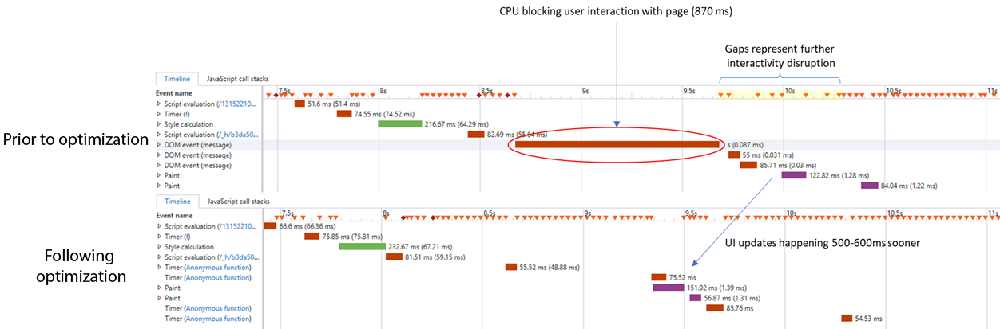

# 訪客ID服務常見問題{#id-service-faqs}

關於使用訪客ID服務之功能、功用和問題之常見問題集。

## 功能 {#section-659e89f8b9a74cb8afff35587dc96836}

**訪客ID服務提供哪些功能？**

請參閱[概觀](../introduction/overview.md)。

**訪客ID服務為何未進行呼叫以擷取ECID？**

此問題可能很難診斷。 您可以查看網站上的內容安全性原則標題。 如果您有嚴格的安全性原則，這些設定可能會封鎖訪客ID服務發出的第三方呼叫。 請參閱[內容安全性原則與訪客ID服務](../reference/csp.md#concept-968c423a7392479db0a0d821ae9783e3)。

**`VisitorAPI.js`檔案儲存空間**

如果您將`VisitorAPI.js`作為本機檔案託管在行動應用程式中，則可能會遇到問題。 建議您將檔案託管在網頁伺服器上。

## 頁面載入時間和延遲 {#section-c78e148d8dbe4c77a436ef0f2af5434b}

**置入訪客ID服務`VisitorAPI.js`程式庫對頁面載入時間有何影響？**

將`VisitorAPI.js`程式庫放置在程式碼的`<head>`區段中的頁面頂端。 這可確保在頁面本文載入前向 ID 發出呼叫，同時可大幅提升傳回 ID 的成功率。

訪客ID服務呼叫為非同步呼叫，且是向[demdex.net網域](https://experienceleague.adobe.com/docs/audience-manager/user-guide/reference/demdex-calls.html?lang=zh-Hant)發出的唯一呼叫。 訪客ID服務呼叫不會阻擋其他元素載入頁面。

若是Target客戶，將訪客ID服務程式碼放置在頁面的`<body>`中可能會增加其封鎖Target呼叫的機率。 如果您必須在頁面本文中放置訪客ID服務程式碼，應放置在開啟的`<body>`標籤之後。

**訪客ID服務是否會在每次載入頁面時進行伺服器呼叫？**

否，此呼叫只會在頁面首次轉譯時執行，並在其後每 7 天執行一次。 於此同時，不需要進行伺服器呼叫。 訪客ID服務會在使用者端模式下運作，不需要進行伺服器呼叫以傳回ID。

請參閱[概觀](../introduction/overview.md)。

**使用訪客ID服務時，哪些因素會導致頁面載入速度緩慢或影響使用者體驗？**

可能的情況很難全數列舉。 有數十億的消費者客戶端連線至我們的服務，而其各種不同的連線位置和方式，都可能影響到效能。 例如:

* 在行動網路上，速度會有大幅差異。 這些網路還會受制於訊號、資料或語音封包遺失的影響。
* 在多種情況下，透過 WiFi 連線的裝置都可能有連線能力的問題。 例如，在咖啡廳等公共場所或機艙之類的其他環境中，封包必須透過人造衛星回送才能到達地面網路，因此封包遺失和速度問題十分常見。
* 未妥善設定的本機網路可能對連線能力和速度產生負面影響。
* 客戶端裝置本身可能也有問題，例如記憶體不足、磁碟交換過度，或 CPU 效能有限，而不足以支應目前的工作負載。
* 瀏覽器會根據瀏覽器製造商和版本，將遠端伺服器呼叫排入佇列並加以執行，甚至以不同的規則處理回應。 此行為會影響到速度和效能。

**您是否能列舉一些您為縮短頁面載入時間所做的改進？**

例如，執行緒轉移。 我們導入了執行緒轉移機制，以因應多個 ID 同步請求。 我們在實驗報告中發現，對於執行多個 ID 同步的客戶，UI 會因為發生大量持續的 CPU 運算而遭到封鎖。 因此，我們導入了執行緒轉移機制以區隔出 ID 同步請求，每個請求可縮短 100 毫秒。

這項變更改善了客戶使用 Visitor 2.3.0+ 和 DIL 6.10+ 的效能。 頁面載入時間的改善如下圖所示：

**使用 CORS 與 JSON-P 的瀏覽器請求是否會影響頁面效能？**

一般而言，使用 CORS 的資源請求會比使用 JSONP 來得好。 使用 JSONP 時，有些瀏覽器會將請求排入佇列，並將請求的優先順序設得比頁面上的其他同步和非同步呼叫低。 CORS 有助於確保在瀏覽器呼叫堆疊中會以較高的優先順序處理這些請求。

請參閱訪客ID服務](../reference/cors.md#concept-6c280446990d46d88ba9da15d2dcc758)中的[CORS支援。

## 安全性 {#section-b176b8492fbe4acfb79ebb30ec902f98}

**訪客ID服務是否支援CORS？**

有。 請參閱訪客ID服務](../reference/cors.md#concept-6c280446990d46d88ba9da15d2dcc758)中的[CORS支援。

**什麼是 CORS？**

*`Cross-Origin Resource Sharing`*&#x200B;或 CORS 是瀏覽器用於請求資源的方法。 訪客ID服務一律會使用CORS （在支援它的瀏覽器中）來要求資源。 在不支援CORS的舊版瀏覽器中，訪客ID服務會透過JSON-P請求資源。 請參閱訪客ID服務](../reference/cors.md#concept-6c280446990d46d88ba9da15d2dcc758)中的[CORS支援。

**如果我有嚴格的安全要求，並且從來不想使用 JSONP，該怎麼做？**

如果您有嚴格的安全要求，請設定訪客ID服務API設定`useCORSOnly: true`。 只有當您確信您的網站訪客使用支援CORS的瀏覽器時，才應該啟用此模式。

請參閱訪客ID服務](../reference/cors.md#concept-6c280446990d46d88ba9da15d2dcc758)中的[CORS支援[useCORSOnly](../library/function-vars/use-cors-only.md#reference-8a9a143d838b48d6b23329b84b13e1fa)。

>[!MORELIKETHIS]
>
>* [客戶服務](https://helpx.adobe.com/tw/marketing-cloud/contact-support.html)

