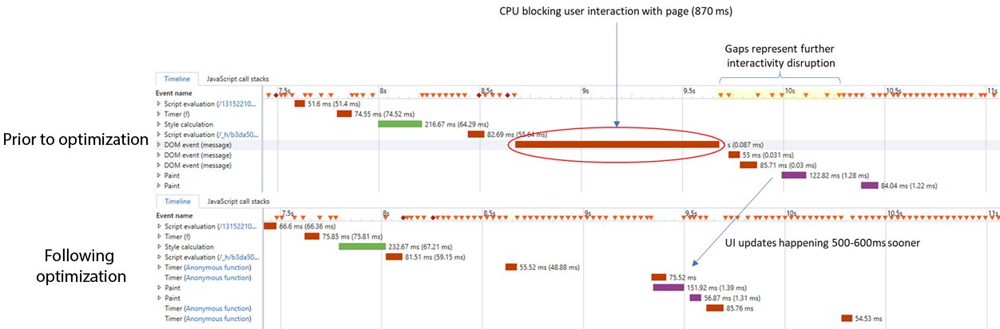

# ID 服務常見問題集{#id-service-faqs}

關於使用 ID 服務的功能、功用和問題之常見問題集。

## 功能 {#section-659e89f8b9a74cb8afff35587dc96836}

**ID服務提供哪些功能或功能？**

請參閱 [概述](../introduction/overview.md)。

**為什麼ID服務未呼叫擷取Experience Cloud ID?**

這可能很難診斷。 您可以檢查網站上的內容安全性原則標題。 如果您有嚴格的安全性原則，這些設定可以封鎖ID服務所發出的第三方呼叫。 See [Content Security Policies and the Experience Cloud Identity Service](../reference/csp.md#concept-968c423a7392479db0a0d821ae9783e3).

**VisitorAPI.js檔案儲存空間**

如果您將VisitorAPI.js代管為行動應用程式中的本機檔案，可能會遇到問題。 建議您將檔案裝載在網頁伺服器上。

## 頁面載入時間與延遲 {#section-c78e148d8dbe4c77a436ef0f2af5434b}

**置入 ID 服務 VisitorAPI.js 程式庫對頁面載入時間有什麼影響?**

將 VisitorAPI.js 程式庫放置在程式碼中 `<head>` 區段的頁面頂端。這可確保在頁面本文載入前向 ID 發出呼叫，同時可大幅提升傳回 ID 的成功率。

The ID service call is asynchronous and is the only call to the [demdex.net domain](https://docs.adobe.com/content/help/zh-Hant/audience-manager/user-guide/reference/demdex-calls.html). ID 服務呼叫不會阻擋其他元素載入頁面。

若是 [!DNL Target] 客戶，在頁面的 `<body>` 放置 ID 服務程式碼可能會增加其成功封鎖 [!DNL Target] 呼叫的機率。如果您必須在頁面本文中放置 ID 服務程式碼，應放置在開放的 `<body>` 標籤後。

**ID服務會在每次載入頁面時進行伺服器呼叫嗎？**

否，此呼叫只會在首次轉譯頁面時發生，之後每7天會發生一次。 同時，伺服器呼叫也不需要。 ID服務在用戶端模式下運作，不需要進行伺服器呼叫以傳回ID。

請參閱[概述](../introduction/overview.md)。

**使用ID服務時，哪些因素會造成頁面載入時間緩慢或影響使用者體驗？**

很難對所有可能的條件進行分類。 數以十億計的消費性客戶端連接到我們的服務，以及它們連接的位置和方式對效能的影響。 例如:

* 在行動網路上，速度差異很大。 這些網路還受到信號和資料或語音包丟失的影響。
* 在多種情況下，通過WiFi連接的設備會受到連接的影響。 例如，在咖啡店等公共場所或飛機等其他環境中，資料包在到達地面網路之前必須通過衛星彈出，丟包和速度問題很常見。
* 配置不良的本地網路可能會對連接和速度產生負面影響。
* 客戶端設備自身可能存在一些問題，如記憶體不足、磁碟交換過多或與當前工作負載相關的CPU功率有限。
* 瀏覽器會根據瀏覽器製造商和版本，佇列並執行遠端伺服器呼叫，甚至使用不同規則處理回應。 此行為會影響速度和效能。

**您是否可以說明您為縮短頁面載入時間而做的一些改進？**

例如，線程產生。 我們引入線程產生機制，以因應多個ID同步要求。 我們從實驗報告中發現，對於執行多個ID同步的客戶，UI會因為大量持續的CPU計算而遭到封鎖。 因此，我們引入了線程產生機制，將ID同步請求分離100毫秒。

這項變更可改善使用Visitor 2.3.0+和DIL 6.10+的客戶的效能。 頁面載入時間的改進如下圖所示：

**使用CORS與JSON-P的瀏覽器要求是否會影響頁面效能？**

使用CORS的資源要求通常比使用JSONP更好。 有了JSONP，有些瀏覽器會佇列請求，並取消優先順序，以取代頁面上其他同步和非同步呼叫。 CORS可協助確保在瀏覽器呼叫堆疊中以較高的優先順序處理這些請求。

請參閱 [Experience Cloud Identity 服務的 CORS 支援](../reference/cors.md#concept-6c280446990d46d88ba9da15d2dcc758)。

## 安全性 {#section-b176b8492fbe4acfb79ebb30ec902f98}

**ID服務是否支援CORS?**

是。請參閱 [Experience Cloud Identity 服務的 CORS 支援](../reference/cors.md#concept-6c280446990d46d88ba9da15d2dcc758)。

**什麼是 CORS?**

*`Cross-Origin Resource Sharing`*&#x200B;或 CORS 是瀏覽器用於要求資源的方法。ID服務會在支援CORS的瀏覽器中，一律使用CORS要求資源。 ID服務會在不支援CORS的舊版瀏覽器中，以JSON-P請求資源。 請參閱 [Experience Cloud](../reference/cors.md#concept-6c280446990d46d88ba9da15d2dcc758)。

**如果我有嚴格的安全要求，並且從來不想使用 JSONP，該怎麼做?**

如果您有嚴格的安全要求，請將 ID 服務 API 設定為 `useCORSOnly: true`。如果您確信您的網站訪客使用支援CORS的瀏覽器，您才應啟用此模式。

See [Experience Cloud](../reference/cors.md#concept-6c280446990d46d88ba9da15d2dcc758) and [useCORSOnly](../library/function-vars/use-cors-only.md#reference-8a9a143d838b48d6b23329b84b13e1fa).

>[!MORELIKETHIS]
>
>* [客戶服務](https://helpx.adobe.com/tw/marketing-cloud/contact-support.html)

