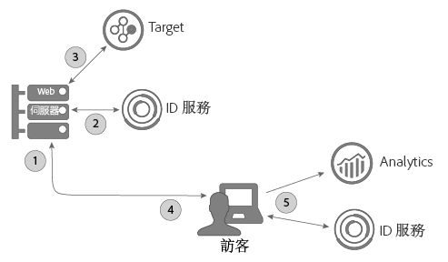
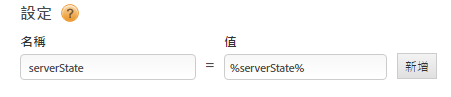

# 使用ID服務搭配A4T和Target伺服器端實作 {#using-the-id-service-with-a-t-and-a-server-side-implementation-of-target}

這些指示適用於擁有混合式伺服器端及用戶端 Target、Analytics 和 ID實施的 A4T 客戶。需要在 NodeJS 或 Rhino 環境中執行 ID 服務的客戶也應檢視這份資訊。ID 服務的例項使用縮短版 VisitorAPI.js 程式碼程式庫，您可從 Node Package Manager (NPM) 下載與安裝。請查看本節的安裝指示及其他設定需求。

## 簡介 {#section-ab0521ff5bbd44c592c3eaab31c1de8b}

當 A4T (及其他客戶) 有以下需要時，可以使用此 ID 服務版本:

* 在其伺服器上轉譯網頁內容並傳遞給瀏覽器進行最終顯示。
* 進行伺服器端 [!DNL Target] 呼叫。
* 對 [!DNL Analytics] 進行用戶端 (在瀏覽器內) 呼叫。
* 同步不同的 [!DNL Target] 和 [!DNL Analytics] ID，以判斷某個解決方案看到的訪客，與另一個解決方案看到的訪客是否為同一人。

## 程式碼下載和提供的介面 {#section-32d75561438b4c3dba8861be6557be8a}

請參閱 [ID 服務 NPM 存放庫](https://www.npmjs.com/package/@adobe-mcid/visitor-js-server)以下載伺服器端程式碼套件並檢閱目前組建隨附的介面。

## 工作流程 {#section-56b01017922046ed96536404239a272b}

以下圖表和章節說明每個伺服器端實施程序步驟中將進行的作業，以及您需要設定的項目。



## 步驟1：請求頁面 {#section-c12e82633bc94e8b8a65747115d0dda8}

當訪客提出 HTTP 要求以載入網頁時，就是伺服器端活動的開始。在此步驟中，您的伺服器會收到此要求並檢查 [AMCV Cookie](../introduction/cookies.md). AMCV Cookie包含訪客 [!DNL Experience Cloud] 的ID(MID)。

## 步驟2：產生ID服務付費 {#section-c86531863db24bd9a5b761c1a2e0d964}

接下來，您需要在伺服器端 *`payload request`* 進行ID服務。裝載要求會:

* 傳遞 AMCV Cookie 至 ID 服務。
* 要求後續步驟中 Target 和 Analytics 所需的資料 (如下所述)。

>[!NOTE]
>
>此方法會要求單一 [!DNL Target]mbox。如果您需在單一呼叫中要求多個 Mbox，請參閱 [generateBatchPayload](https://www.npmjs.com/package/@adobe-mcid/visitor-js-server#generatebatchpayload)。

您的裝載要求應看起來像下列的程式碼範例。在程式碼範例中，`visitor.setCustomerIDs` 是選用函數。如需詳細資訊，請參閱 [客戶ID和驗證狀態](../reference/authenticated-state.md) 。

```js
//Import the ID service server package 
var Visitor = require("@adobe-mcid/visitor-js-server"); 
 
//Pass in your Organization ID to instantiate Visitor 
var visitor = new Visitor("Insert Experience Cloud ID here"); 
 
// 
<i>(Optional)</i> Set a custom customer ID 
visitor.setCustomerIDs({ 
     userid:{ 
          id:"1234", 
          authState: Visitor.AuthState.UNKNOWN //AuthState is a static property of the Visitor class 
     } 
}); 
 
//Parse the visitor's HTTP request for the AMCV cookie 
var cookies = cookie.parse(req.headers.cookie || ""); 
var cookieName = visitor.getCookieName(); // Visitor API that returns the cookie name. 
var amcvCookie = cookies[cookieName]; 
 
//Generate the payload request pass your mbox name and the AMCV cookie if present 
var visitorPayload = visitor.generatePayload({ 
     mboxName: "bottom-banner-mbox", 
     amcvCookie: amcvCookie 
});
```

ID 服務會在類似下列範例的 JSON 物件中傳回裝載。[!DNL Target] 需要用到裝載資料。

```js
{ 
    "marketingCloudVisitorId": "02111696918527575543455026275721941645", 
    "mboxParameters": { 
        "mboxAAMB": "abcd1234", 
        "mboxMCGLH": "9", 
        "mboxMCSDID": "56BE026543F7E211-1CC51BCAAE88F0D2", 
        "vst.userid.id": "1234567890", 
        "vst.userid.authState": 0 
    } 
}
```

如果您的訪客沒有 AMCV Cookie，則裝載會省略這些機碼值組:

* `marketingCloudvisitorId`
* `mboxAAMB`
* `mboxMCGLH`

## 步驟3：新增裝載至Target呼叫 {#section-62451aa70d2f44ceb9fd0dc2d4f780f7}

在您的伺服器收到來自 ID 服務的裝載資料後，您需將其他程式碼實例化，以便與要傳遞給 [!DNL Target] 的資料合併。傳遞給 [!DNL Target] 的最終 JSON 物件看起來會類似這樣:

```js
{ 
"mbox" : "target-global-mbox", 
"marketingCloudVisitorId":"02111696918527575543455026275721941645", 
"requestLocation" : { 
     "pageURL" : "http://www.domain.com/test/demo.html", 
     "host" : "localhost:3000" 
     }, 
"mboxParameters" : { 
     "mboxAAMB" : "abcd1234", 
     "mboxMCGLH" : "9", 
     "mboxMCSDID": "56BE026543F7E211-1CC51BCAAE88F0D2", 
     "vst.userid.id": "1234567890", 
     "vst.userid.authState": 0, 
     } 
} 
```

## 步驟4：取得ID服務的伺服器狀態 {#section-8ebfd177d42941c1893bfdde6e514280}

伺服器狀態資料包含伺服器上已完成的工作相關資訊。用戶端 ID 服務程式碼需要這項資訊。實作ID服務(DTM)的 [!DNL Dynamic Tag Manager] 客戶可設定DTM透過該工具傳遞伺服器狀態資料。如果您是透過非標準程序設定 ID 服務，則需要使用您自己的程式碼來傳回伺服器狀態。用戶端 ID 服務和 [!DNL Analytics] 程式碼會在頁面載入時傳遞狀態資料給 Adobe。

**透過DTM取得伺服器狀態**

如果您透過 DTM 實施 ID 服務，則需新增程式碼至您的頁面並在 DTM 設定中指定名稱值組。

**頁面代碼**

將此程式碼新增至HTML頁面 `<head>` 的標籤：

```js
//Get server state 
var serverState = visitor.getState(); 
 
Response.send(" 
... 
<head> 
     <script> 
          //Add 'serverState' as a stringified JSON global variable. 
          "var serverState = "+ JSON.stringify(serverState) +";  
     </script> 
     <script src = "DTM script (satellite JS)"> 
     </script> 
</head> 
...
```

**DTM 設定**

在 ID 服務例項的 **[!UICONTROL 「一般 &gt; 設定」]區段中將下列項目新增為名稱值組:**

* **[!UICONTROL 名稱:]** serverState
* **[!UICONTROL 值:]** %serverState%

   >[!IMPORTANT]
   >
   >值名稱必須符合您在頁面程式碼中設定 `serverState` 的變數名稱。

您進行的設定應該看起來如下所示:



另請參閱,[適用於DTM的Experience Platform Identity Service設定](../implementation-guides/standard.md#concept-fb6cb6a0e6cc4f10b92371f8671f6b59)。

**取得不需DTM的伺服器狀態**

如果您的 ID 服務是非標準實施，則您必須設定此程式碼為當其組合所要求的頁面時是在您的伺服器上執行:

```js
//Get server state 
var serverState = visitor.getState(); 
 
Response.send(" 
... 
<head> 
     <script src="VisitorAPI.js"></script> 
     <script> 
          var visitor = Visitor.getInstance(orgID, { 
          serverState: serverState  
          ... 
     </script> 
</head> 
...
```

## 步驟5：提供頁面並傳回Experience Cloud資料 {#section-4b5631a0d75a41febd6f43f8c214c263}

這時，Web 伺服器會傳送頁面內容給訪客的頁面。從這時開始，由瀏覽器 (而非伺服器) 進行所有剩餘的 ID 服務與 [!DNL Analytics] 呼叫。例如，在瀏覽器中:

* ID 服務從伺服器收到狀態資料，並將 SDID 傳遞至 AppMeasurement。
* AppMeasurement 傳送關於頁面點擊的資料給 [!DNL Analytics]，包括 SDID。
* [!DNL Analytics][!DNL Target] 並比較此訪客的SDID。當 SDID 相同時，[!DNL Target] 和 [!DNL Analytics]便將伺服器端呼叫和用戶端呼叫結合在一起。此時，兩個解決方案將這名訪客視為同一人。

>[!MORE_贊_ this]
>
>* [來自 Node Package Manager 的伺服器端 ID 服務套件](https://www.npmjs.com/package/@adobe-mcid/visitor-js-server)

