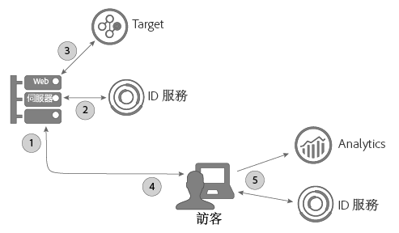

# 將訪客ID服務用於A4T以及伺服器端的Target實作 {#using-the-id-service-with-a-t-and-a-server-side-implementation-of-target}

這些指示適用於擁有混合式伺服器端及使用者端Target、Analytics和訪客ID實作的A4T客戶。 需要在NodeJS或Rhino環境中執行訪客ID服務的客戶也應該檢閱此資訊。 此訪客ID服務執行個體會使用您從Node Package Manager (NPM)下載及安裝的簡化版`VisitorAPI.js`程式碼庫。 請檢閱此章節，以了解安裝指示和其他設定要求。

## 簡介 {#section-ab0521ff5bbd44c592c3eaab31c1de8b}

A4T （和其他客戶）在需要進行下列作業時，可以使用這個版本的訪客ID服務：

* 在其伺服器上轉譯網頁內容，並將其傳遞給瀏覽器以供最後顯示。
* 進行伺服器端Target呼叫。
* 對Analytics發出使用者端（在瀏覽器內）呼叫。
* 同步不同的Target和Analytics ID，以判斷某個解決方案看到的訪客，與另一個解決方案看到的訪客是否為同一人。

## 程式碼下載與提供的介面 {#section-32d75561438b4c3dba8861be6557be8a}

檢視[訪客ID服務NPM存放庫](https://www.npmjs.com/package/@adobe-mcid/visitor-js-server)以下載伺服器端程式碼套件並檢閱目前組建中包含的介面。

## 工作流程 {#section-56b01017922046ed96536404239a272b}

以下圖表和章節說明每個伺服器端實作程序步驟中將進行的作業，以及您需要設定的項目。



## 步驟 1：要求頁面 {#section-c12e82633bc94e8b8a65747115d0dda8}

當訪客發出載入網頁的 HTTP 要求時，伺服器端活動就會開始。 在此步驟期間，您的伺服器會接收這個要求，並檢查是否有 [AMCV Cookie](../introduction/cookies.md)。 AMCV Cookie包含訪客的ECID。

## 步驟2：產生訪客ID服務裝載 {#section-c86531863db24bd9a5b761c1a2e0d964}

接下來，您需要對訪客ID服務發出伺服器端&#x200B;*`payload request`*。 裝載要求：

* 將AMCV Cookie傳遞至訪客ID服務。
* 在底下所述的後續步驟中要求 Target 和 Analytics 所需的資料。

>[!NOTE]
>
>此方法會向Target要求單一mbox。 如果您需要在單一呼叫中要求多個 Mbox，請參閱 [generateBatchPayload](https://www.npmjs.com/package/@adobe-mcid/visitor-js-server#generatebatchpayload)。

您的裝載要求應看起來像下列的程式碼範例。 在程式碼範例中，`visitor.setCustomerIDs` 是選用函數。 如需詳細資訊，請參閱[客戶 ID 和驗證狀態](../reference/authenticated-state.md)。

```js
//Import the Visitor ID Service server package 
var Visitor = require("@adobe-mcid/visitor-js-server"); 
 
//Pass in your IMS org ID to instantiate Visitor 
var visitor = new Visitor("Insert ECID here"); 
 
// 
<i>(Optional)</i> Set a custom customer ID 
visitor.setCustomerIDs({ 
     userid:{ 
          id:"1234", 
          authState: Visitor.AuthState.UNKNOWN //AuthState is a static property of the Visitor class 
     } 
}); 
 
//Parse the visitor's HTTP request for the AMCV cookie 
var cookies = cookie.parse(req.headers.cookie || ""); 
var cookieName = visitor.getCookieName(); // Visitor API that returns the cookie name. 
var amcvCookie = cookies[cookieName]; 
 
//Generate the payload request pass your mbox name and the AMCV cookie if present 
var visitorPayload = visitor.generatePayload({ 
     mboxName: "bottom-banner-mbox", 
     amcvCookie: amcvCookie 
});
```

訪客ID服務會在類似下列範例的JSON物件中傳回裝載。 Target需要用到裝載資料。

```js
{ 
    "marketingCloudVisitorId": "02111696918527575543455026275721941645", 
    "mboxParameters": { 
        "mboxAAMB": "abcd1234", 
        "mboxMCGLH": "9", 
        "mboxMCSDID": "56BE026543F7E211-1CC51BCAAE88F0D2", 
        "vst.userid.id": "1234567890", 
        "vst.userid.authState": 0 
    } 
}
```

如果您的訪客沒有 AMCV Cookie，則裝載會省略這些機碼值組:

* `marketingCloudvisitorId`
* `mboxAAMB`
* `mboxMCGLH`

## 步驟 3：將裝載新增至 Target 呼叫 {#section-62451aa70d2f44ceb9fd0dc2d4f780f7}

在您的伺服器收到來自訪客ID服務的裝載資料後，您需要將其他程式碼例項化，以便與傳遞至Target的資料合併。 傳遞至Target的最終JSON物件看起來會類似這樣：

```js
{ 
"mbox" : "target-global-mbox", 
"marketingCloudVisitorId":"02111696918527575543455026275721941645", 
"requestLocation" : { 
     "pageURL" : "http://www.domain.com/test/demo.html", 
     "host" : "localhost:3000" 
     }, 
"mboxParameters" : { 
     "mboxAAMB" : "abcd1234", 
     "mboxMCGLH" : "9", 
     "mboxMCSDID": "56BE026543F7E211-1CC51BCAAE88F0D2", 
     "vst.userid.id": "1234567890", 
     "vst.userid.authState": 0, 
     } 
} 
```

## 步驟4：取得訪客ID服務的伺服器狀態 {#section-8ebfd177d42941c1893bfdde6e514280}

伺服器狀態資料包含伺服器上所完成之工作的相關資訊。 使用者端訪客ID服務程式碼需要此資訊。 如果您是透過非標準程式設定訪客ID服務，您將需要使用自己的程式碼來傳回伺服器狀態。 使用者端訪客ID服務和Analytics程式碼會在頁面載入時傳遞狀態資料給Adobe。

如果您的Visitor ID服務是非標準實施，則您必須設定此程式碼為當其組合所要求的頁面時是在您的伺服器上執行：

```js
//Get server state 
var serverState = visitor.getState(); 
 
Response.send(" 
... 
<head> 
     <script src="VisitorAPI.js"></script> 
     <script> 
          var visitor = Visitor.getInstance(orgID, { 
          serverState: serverState  
          ... 
     </script> 
</head> 
...
```

## 步驟5：提供頁面並傳回CX Enterprise資料 {#section-4b5631a0d75a41febd6f43f8c214c263}

這時，Web 伺服器會傳送頁面內容給訪客的頁面。 從這時開始，由瀏覽器（而非伺服器）進行所有剩餘的訪客ID服務與Analytics呼叫。 例如在瀏覽器中：

* 訪客ID服務會從伺服器接收狀態資料，並將SDID傳遞至AppMeasurement。
* AppMeasurement會將頁面點選的相關資料（包括SDID）傳送至Analytics。
* Analytics和Target會比較此訪客的SDID。 當SDID相同時，Target和Analytics便將伺服器端呼叫和使用者端呼叫結合在一起。 此時，兩個解決方案將這名訪客視為同一人。

>[!MORELIKETHIS]
>
>* 來自Node Package Manager的[伺服器端訪客ID服務套件](https://www.npmjs.com/package/@adobe-mcid/visitor-js-server)

