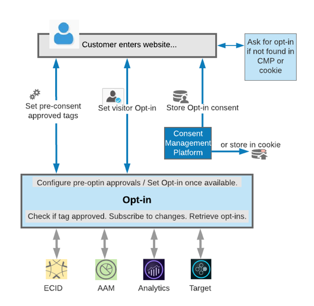

# 選擇加入服務{#opt-in-service}

如果您可以在用戶造訪網站時，在他們的裝置或瀏覽器上設定 Cookie，則選擇加入服務可讓您設定訪客的通訊協定。

選擇加入服務是 Experience Cloud ID (ECID) 服務的擴充功能，其設計可讓您控制 Experience Cloud 解決方案是否能在用戶同意前，在網頁上建立訪客的 Cookie，以及要使用哪個解決方案來執行。選擇加入服務也可讓您設定通訊協定，以便整合您的同意管理平台 (CMP) 和現有系統，融入更廣大的設計中。

透過使用選擇加入服務，您可指定訪客是否能選擇一次加入所有 Adobe 解決方案，或依序提出解決方案以要求各方案的權限。客戶完成並記錄核准程序後，您便可以從所有的 Adobe 解決方案擷取 CMP 訪客核准。

使用 [Adobe Experience Platform 中的標記](https://experienceleague.adobe.com/docs/experience-platform/tags/home.html) 搭配[選擇加入擴充功能](../../implementation-guides/opt-in-service/launch.md)，即可輕鬆實作及設定選擇加入服務。亦可使用 [DTM](../../implementation-guides/opt-in-service/optin-dtm.md) 進行實作和設定。

請參閱[設定選擇加入服務](../../implementation-guides/opt-in-service/getting-started.md)了解如何開始使用。

>[!NOTE]
>
>選擇加入服務可讓您設定系統以核准或拒絕是否只下載 Adobe Cookie。不提供收集用戶同意偏好設定的支援，也並非偏好設定的存放庫。

>[!IMPORTANT]
>
>本文件的內容不是法律建議，且用意並非要取代法律建議。在設定您的選擇加入實作時，請洽詢貴公司的法務部門，以獲得有關同意和實務的建議。

## 不同 Experience Cloud 解決方案中的選擇加入 {#section-053e6224505542cf961896f0ca869e52}

選擇加入服務是根據您自身需求，用來建立同意選擇加入工作流程的工具，可讓您設計在用戶或同意控制者給予同意之前和之後所使用的反應 (執行標籤) 工作流程。

選擇加入服務可讓您設定 Adobe 解決方案的同意管理作法，以達成下列目的:

* 指出同意收集要求通常是否適用於用戶。
* 指定允許哪些解決方案產生 Cookie。
* 為類別未明確獲得用戶同意或被用戶拒絕的任何解決方案套用預設偏好設定。
* 根據用戶同意設定的變更觸發自訂回應，好讓您保存或更新用戶的設定。

您可以使用選擇加入服務設定網站，允許在用戶選擇前，讓部分 Cookie 載入預先同意。您可以為新客戶設定選擇加入服務，以便在用戶同意後或選項開放使用後載入 Cookie。您也可以從您現有的同意管理平台儲存及擷取選擇加入同意，或直接在 Cookie 中儲存選擇加入權限。

然後 Adobe 解決方案可以檢查此標籤是否已核准、訂閱變更，然後擷取所有選擇加入客戶。選擇加入服務可讓您直接透過解決方案的 JavaScript 程式庫或 ECID (若已實作) 取得權限。
