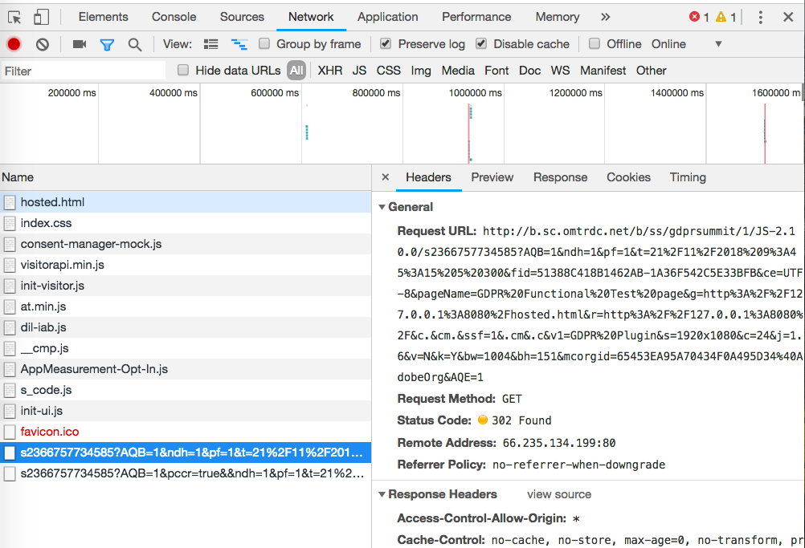

# 驗證選擇加入服務{#validating-opt-in-service}

在網站上啟用選擇加入後，請使用瀏覽器中的開發人員工具，運用驗證方法測試該服務是否順利運作。

## 使用案例1：啟用選擇加入服務 {#section-c8fe1ee3711b420c8186c7057abbecb3}

```
Visitor.getInstance({{YOUR_ORG_ID}}, { 
    doesOptInApply: true 
});
```


在載入頁面之前，清除您的快取和 Cookie。

在 Chrome 中，以滑鼠右鍵按一下網頁，然後選取 [檢查]。如同上面的螢幕擷圖，選取 *Network* 索引標籤以檢視從瀏覽器發出的要求。

在上面的範例中，我們已將以下 Adobe JS 標籤安裝在頁面上：ECID、AAM、Analytics 和 Target。

**如何證實選擇加入順利運作:**

您應該不會看到對 Adobe 伺服器的任何要求：

* demdex.net/id
* demdex.net/event
* omtrdc.net/b/ss
* omtrdc.net/m2
* everesttech.net

>[!NOTE]
>
>您可能會看到目標為 `http://dpm.demdex.net/optOutStatus` 的呼叫，這是「唯讀」端點，用來擷取訪客的選擇退出狀態。此端點將不會產生任何第三方 Cookie，也不會從此頁面收集任何資訊。

您應該不會看到Adobe標籤所建立的任何Cookie：(AMCV_{{YOUR_ORG_ID}}、mbox、demdex、s_cc、s_sq、everest_g_v2、everest_session_v2)

在 Chrome 中，移至 *Application* 索引標籤，並展開 *Storage* 底下的 *Cookies* 區段，然後選取您網站的網域名稱：


## 使用案例2：啟用選擇加入和儲存 {#section-bd28326f52474fa09a2addca23ccdc0f}

```
Visitor.getInstance({{YOUR_ORG_ID}}, { 
    doesOptInApply: true, 
    isOptInStorageEnabled: true 
});
```

使用案例 2 的唯一差異在於您將會看到&#x200B;*新的 Cookie*，其中將包含訪客所提供的選擇加入權限：**adobeujs-optin**

## 使用案例3：啟用選擇加入及預先核准Adobe Analytics {#section-257fe582b425496cbf986d0ec12d3692}

```
var preApproveAnalytics = {}; 
preApproveAnalytics[adobe.OptInCategories.ANALYTICS] = true;

Visitor.getInstance({{YOUR_ORG_ID}}, { 
    doesOptInApply: true, 
    preOptInApprovals: preApproveAnalytics 
});
```

由於 Adobe Analytics 已事先核准選擇加入，您將會在「Network」索引標籤中看到傳送給您的追蹤伺服器的請求：



而且您將會在「Application」索引標籤中看到 Analytics Cookie：


## 使用案例4：啟用選擇加入和IAB {#section-64331998954d4892960dcecd744a6d88}

```
Visitor.getInstance({{YOUR_ORG_ID}}, { 
    doesOptInApply: true, 
    isIabContext: true 
});
```

**如何在頁面上檢視您目前的 IAB 同意：**

開啟開發人員工具，並選取 *Console* 索引標籤。貼上以下程式碼片段，並按下 Enter 鍵：

```
<codeblock>
  __cmp("getVendorConsents", null, function (vendorConsents) { 
     console.log("Vendor Consent:", vendorConsents); }) 
</codeblock>  
  
```

以下是在已核准目的 1、2 和 5 而且已核准 Audience Manager 廠商 ID 時的範例輸出：

* demdex.net/id：此呼叫的存在證明 ECID 已向 demdex.net 要求 ID
* demdex.net/event：此呼叫的存在證明 DIL 資料收集呼叫如預期般運作。
* demdex.net/dest5.html：此呼叫的存在證明 ID 同步已被觸發。


如果上述其中一項無效，您將不會看到任何要求傳送給 Adobe 伺服器，也不會有任何 Adobe Cookie：

* 目的 1、2 或 5 未核准。
* Audience Manager 廠商 ID 未核准。
