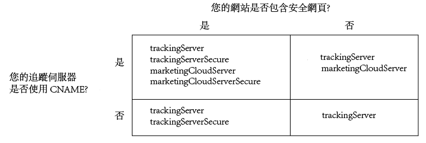

# 實作適用於Analytics、Audience Manager和Target的Adobe訪客ID服務 {#implement-the-experience-cloud-id-service-for-analytics-audience-manager-and-target}

這些指示適用於想使用訪客ID服務但不想使用[標籤](https://experienceleague.adobe.com/docs/experience-platform/tags/home.html?lang=zh-Hant)的Analytics、Audience Manager和Target客戶。 不過，我們強烈建議您使用標籤來實作訪客ID服務。 標記可簡化實作工作流程，並自動確保程式碼放置和順序的正確性。

>[!IMPORTANT]
>
>開始之前，請先閱讀訪客ID服務[需求](../reference/requirements.md)，並注意本實作特有的下列需求：
>
>* 使用 s_code 的客戶無法完成此程序。 請升級至 mbox 程式碼 v61 以完成此程序。
>* 請&#x200B;*先*&#x200B;在開發環境中設定與測試此程式碼，然後才在生產環境中實作。

## 步驟 1：規劃伺服器端轉送 {#section-880797cc992d4755b29cada7b831f1fc}

除了此處所述步驟以外，使用Analytics和Audience Manager的客戶也應移轉至伺服器端轉送。 伺服器端轉送功能可讓您移除 DIL (Audience Manager 的資料收集程式碼)，並將其取代為[對象管理模組](https://experienceleague.adobe.com/docs/audience-manager/user-guide/implementation-integration-guides/integration-other-solutions/audience-management-module.html?lang=zh-Hant)。 如需詳細資訊，請參閱[伺服器端轉送文件](https://experienceleague.adobe.com/docs/analytics/admin/admin-tools/manage-report-suites/edit-report-suite/report-suite-general/server-side-forwarding/ssf.html?lang=zh-Hant)。

要移轉至伺服器端轉送，必須進行規劃和協調。 此程序牽涉到對您的網站程式碼進行的外部變更，以及 Adobe 為了佈建您的帳戶而須執行的內部步驟。 事實上，其中許多移轉程序都需要並行執行，並且一起發行。 您的實作路徑應依照以下事件順序進行：

1. 與您的Analytics和Audience Manager聯絡人合作，一同規劃訪客ID服務與伺服器端轉送移轉。 選擇追蹤伺服器是此規劃的重要一部分。

1. 完成[整合與佈建網站](https://adobe.allegiancetech.com/cgi-bin/qwebcorporate.dll?idx=X8SVES)上的表單即可開始使用。

1. 同時實作訪客ID服務與受眾管理模組。 為了正常運作，「對象管理模組」（伺服器端轉送）和「訪客ID服務」必須針對相同的頁面集同時發行。

## 步驟2：下載訪客ID服務程式碼 {#section-0780126cf43e4ad9b6fc5fe17bb3ef86}

訪客ID服務需要`VisitorAPI.js`程式碼程式庫。 若要下載此程式碼程式庫：

1. 移至&#x200B;**[!UICONTROL Admin > Code Manager]**。
1. 在程式碼管理員中，按一下&#x200B;**[!UICONTROL JavaScrpt (New)]**&#x200B;或&#x200B;**[!UICONTROL JavaScript (Legacy)]**。 即會下載壓縮的程式碼程式庫。

1. 解壓縮程式碼檔案，並開啟 `VisitorAPI.js` 檔案。

## 步驟3：將Visitor.getInstance函式新增至Visitor ID服務程式碼 {#section-9e30838b4d0741658a7a492153c49f27}

>[!IMPORTANT]
>
>* 舊版的訪客ID服務API將此函式放置在不同的位置，且需要不同的語法。 如果您要從 [1.4 版](../release-notes/notes-2015.md#section-f5c596f355b14da28f45c798df513572)之前的版本移轉，請留意此處說明的新位置和語法。
>* ALL CAPS 中的程式碼是實際值的預留位置。 請將此文字取代為您的IMS組織ID、追蹤伺服器URL或其他命名值。

**第 1 部分：複製下方的 Visitor.getInstance 函數**

```js
var visitor = Visitor.getInstance("INSERT-IMS-ORG-ID-HERE", { 
     trackingServer: "INSERT-TRACKING-SERVER-HERE", // same as s.trackingServer 
     trackingServerSecure: "INSERT-SECURE-TRACKING-SERVER-HERE", // same as s.trackingServerSecure 
 
     // To enable CNAME support, add the following configuration variables 
     // If you are not using CNAME, DO NOT include these variables 
     marketingCloudServer: "INSERT-TRACKING-SERVER-HERE", 
     marketingCloudServerSecure: "INSERT-SECURE-TRACKING-SERVER-HERE" // same as s.trackingServerSecure 
}); 
```

**第2部分：將函式程式碼新增至`VisitorAPI.js`檔案**

將 `Visitor.getInstance` 函數放置在程式碼區塊之後的檔案結尾。 完成編輯的檔案應該如下所示：

```js
/* 
========== DO NOT ALTER ANYTHING BELOW THIS LINE ========== 
Version and copyright section 
*/ 
 
// Visitor API code library section 
 
// Put Visitor.getInstance at the end of the file, after the code library 
 
var visitor = Visitor.getInstance("INSERT-IMS-ORG-ID-HERE", { 
     trackingServer: "INSERT-TRACKING-SERVER-HERE", // same as s.trackingServer 
     trackingServerSecure: "INSERT-SECURE-TRACKING-SERVER-HERE", // same as s.trackingServerSecure 
 
     // To enable CNAME support, add the following configuration variables 
     // If you are not using CNAME, DO NOT include these variables 
     marketingCloudServer: "INSERT-TRACKING-SERVER-HERE", 
     marketingCloudServerSecure: "INSERT-SECURE-TRACKING-SERVER-HERE" // same as s.trackingServerSecure 
}); 
```

## 步驟4：將您的IMS組織ID新增至Visitor.getInstance {#section-e2947313492546789b0c3b2fc3e897d8}

在`Visitor.getInstance`函式中，將`INSERT-IMS-ORG-ID-HERE`取代為您的IMS組織ID。 如果您不知道您的IMS組織ID，可以在CX企業管理頁面上找到。 您編輯的函數看起來可能類似於下列範例。

`var visitor = Visitor.getInstance("1234567ABC@AdobeOrg", { ...`

>[!IMPORTANT]
>
>*請勿*&#x200B;變更IMS組織ID中的字元大小寫。 ID 區分大小寫，需如實使用。

## 步驟 5：將追蹤伺服器新增至 Visitor.getInstance {#section-0dfc52096ac2427f86045aab9a0e0dfc}

Analytics 會使用追蹤伺服器進行資料收集。

**第 1 部分：尋找您的追蹤伺服器 URL**

檢查 `s_code.js` 或 `AppMeasurement.js` 檔案，以尋找追蹤伺服器 URL。 您想根據下列變數指定 URL：

* `s.trackingServer`
* `s.trackingServerSecure`

**第 2 部分：設定追蹤伺服器變數**

若要確認所應使用的追蹤伺服器變數：

1. 回答下列決策對照表中的問題。 請使用與您的答案相對應的變數。
1. 將追蹤伺服器預留位置取代為您的追蹤伺服器 URL。
1. 將未使用的追蹤伺服器和CX Enterprise伺服器變數從程式碼中移除。



>[!NOTE]
>
>使用時，請將CX Enterprise伺服器URL與其對應的追蹤伺服器URL配對，如下所示：

* CX Enterprise伺服器URL =追蹤伺服器URL
* CX Enterprise伺服器安全URL =追蹤伺服器安全URL

若不清楚如何尋找您的追蹤伺服器，請參閱[常見問題集](../faq-intro/faq.md)和[正確填入 trackingServer 及 trackingServerSecure 變數](https://helpx.adobe.com/tw/analytics/kb/determining-data-center.html#)。

## 步驟 6：更新您的 AppMeasurement.js 檔案 {#section-5517e94a09bc44dfb492ebca14b43048}

此步驟需要用到 [!UICONTROL AppMeasurement]。 如果您仍在使用 s_code，將無法繼續。

將下方所示的 `Visitor.getInstance` 函數新增至您的 `AppMeasurement.js` 檔案。 將此函數放置在包含設定的相同區段 (例如 `trackDownloads`、`linkInternalFilters`、`charSet` 等)。

`s.visitor = Visitor.getInstance("INSERT-IMS-ORG-ID-HERE");`

>[!IMPORTANT]
>
>此時您應移除Audience Manager DIL程式碼，改為使用「對象管理模組」。 如需相關指示，請參閱[實作伺服器端轉送](https://experienceleague.adobe.com/docs/analytics/admin/admin-tools/server-side-forwarding/ssf.html?lang=zh-Hant)。

***(可選用，但建議使用)* 建立自訂 Prop &#x200B;**

在 `AppMeasurement.js` 中設定自訂 prop 以測量涵蓋範圍. 將此自訂 Prop 新增至 `doPlugins` 檔案的 `AppMeasurement.js` 函數：

```js
// prop1 is used as an example only. Choose any available prop. 
s.prop1 = (typeof(Visitor) != "undefined" ? "VisitorAPI Present" : "VisitorAPI Missing");
```

## 步驟 7：將訪客 API 程式碼新增至頁面 {#section-c2bd096a3e484872a72967b6468d3673}

將 `VisitorAPI.js` 檔案放入每個頁面的 `<head>` 標籤中。 將 `VisitorAPI.js` 檔案放到頁面中時：

* 放在 `<head>` 區段的開頭處，使其出現在其他解決方案標籤的前面。
* 必須在AppMeasurement和其他CX Enterprise解決方案的程式碼之前執行此檔案。

## 步驟 8：(選用) 設定寬限期 {#section-aceacdb7d5794f25ac6ff46f82e148e1}

若其中有任何使用案例適用於您的情況，請要求[客戶服務](https://helpx.adobe.com/tw/marketing-cloud/contact-support.html)設定暫時的寬限期。 寬限期最多可達 180 天。 如有必要，您可以更新寬限期。

**部分實作**

如果部分頁面使用訪客ID服務，部分頁面未使用，且這些頁面全部都向相同的Analytics報表套裝報告，則您需要寬限期。 如果您有跨網域報告的全域報告套裝，就常會有此需要。

將訪客ID服務部署在報告至相同報表套裝的所有網頁上後，請停止寬限期。

**s_vi Cookie 需求**

如果您要求新訪客在移轉至訪客ID服務後必須要有s_vi Cookie，則需要寬限期。 如果實作讀取 s_vi Cookie 並將其儲存在變數中，這個情況是很常見的。

當您的實作可擷取 MID，而非讀取 s_vi Cookie 之後，則可停止寬限期。

另請參閱[Cookie和訪客ID服務](../introduction/cookies.md)。

**點擊流資料整合**

如果您將資料從點擊流資料資料源傳送至內部系統，而且該程序使用 `visid_high` 和 `visid_low` 欄位，則需要寬限期。

您的資料擷取程序可使用 `post_visid_high` 和 `post_visid_low` 欄之後，即可停止寬限期。

另請參閱[點按流資料欄參考](https://experienceleague.adobe.com/docs/analytics/export/analytics-data-feed/data-feed-overview.html?lang=zh-Hant)。

## 步驟 9：測試並驗證 {#section-f857542bfc70496dbb9f318d6b3ae110}

本實作中的CX Enterprise解決方案會以機碼值組的形式傳回ID。 每個解決方案使用不同的機碼（例如Analytics SDID與Target mboxMCSDID）來儲存相同的ID。 若要測試實作，請在開發環境中載入您的頁面。 使用監控 HTTP 要求和回應的瀏覽器主控台或軟體，來檢查下表中列出的 ID。 如果下列機碼值組傳回相同的ID值，代表已正確實作訪客ID服務。

>[!TIP]
>
>您可以使用 [Adobe 偵錯工具](https://experienceleague.adobe.com/docs/analytics/implementation/validate/debugger.html?lang=zh-Hant)或 [Charles HTTP Proxy](https://www.charlesproxy.com/) 來檢查這些解決方案特有的 ID。 不過，您當然可以使用最適合您的任何工具或偵錯工具。

**所有解決方案**

檢查：

* [AMCV Cookie](../introduction/cookies.md)，在托管頁面的網域中。
* ECID搭配Adobe Debugger或您慣用的偵錯工具。

如需可協助您判斷訪客ID服務是否正常運作的其他檢查，請參閱[測試及驗證訪客ID服務](../implementation-guides/test-verify.md)。

**Analytics**

檢查 JavaScript 請求中的 SDID 識別碼。 Analytics SDID 應符合 Target mboxMCSDID。

如果測試傳回 AID，則表示有下列其中一種情況：

* 您在移轉舊版Analytics ID的程式中傳回訪客。
* 您已啟用[寬限期](https://experienceleague.adobe.com/zh-hant/docs/analytics/implementation/id/migration)。

如果看到AID，請根據Target mboxMCAVID檢查其值。 若已正確實作訪客ID服務，這些值會相同。

**Audience Manager**

若要測試伺服器端轉送，請參閱[如何驗證您的伺服器端轉送實作](https://experienceleague.adobe.com/docs/analytics/admin/admin-tools/server-side-forwarding/ssf-verify.html?lang=zh-Hant)。

**Target**

檢查：

* mboxMCGVID
* mboxMCSDID (mboxMCSDID 應符合 Analytics SDID)。

如果測試傳回 mboxMCAVID，則表示有下列其中一種情況：

* 您在移轉舊版Analytics ID的程式中傳回訪客。
* 您已啟用寬限期。

如果看到mboxMCAVID，請根據Analytics AID檢查其值。 若已正確實作訪客ID服務，這些值會相同。

**部署**

## 步驟 10：部署 {#section-4188fa95e7dc455a986b48a6c517c1c9}

在程式碼通過測試後加以部署。

如果您已啟用寬限期：

* 確定 Analytics ID (AID) 與 MID 位於影像請求中。
* 當您符合[中止條件](../implementation-guides/setup-aam-analytics-target.md#section-aceacdb7d5794f25ac6ff46f82e148e1)時，請記得停用寬限期。

