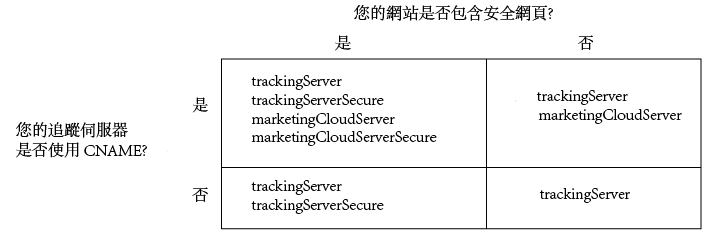

# 實施適用於 Analytics、Audience Manager 和 Target 的 Experience Cloud ID 服務 {#implement-the-experience-cloud-id-service-for-analytics-audience-manager-and-target}

這些指示適用於想要使用Experience Cloud ID服務且不使用動態標籤管理(DTM)的Analytics、Audience Manager和Target客戶。不過，我們強烈建議您使用 DTM 來實施 ID 服務。DTM 可簡化工作流程並自動確保程式碼的放置和順序正確無誤。

>[!IMPORTANT]
>
>Read the ID service [requirements](../reference/requirements.md) before you begin and note the following requirements that are specific to this implementation: &gt;
>* 使用 s_code 的客戶無法完成此程序。請升級至 Mbox 程式碼 v61 版以完成此程序。
>* 請*先*在開發環境中設定與測試此程式碼，然後才在生產環境中實施。
>


## Step 1: Plan for server-side forwarding {#section-880797cc992d4755b29cada7b831f1fc}

除了此處所述步驟以外，使用 [!DNL Analytics] 和 [!DNL Audience Manager] 的客戶也應移轉至伺服器端轉送。伺服器端轉送可讓您移除 DIL (Audience Manager 的資料收集程式碼)，改為使用[觀眾管理模組](https://marketing.adobe.com/resources/help/en_US/aam/c_profiles_audiences.html)。如需詳細資訊，請參閱[伺服器端轉送文件](https://marketing.adobe.com/resources/help/en_US/reference/ssf.html)。

移轉至伺服器端轉送需要規劃與協調。此程序包括對您的網站程式碼進行外部變更，以及 Adobe 佈建您的帳戶所必須進行的內部步驟。事實上，其中許多移轉程序必須同時進行，以及同時發行。您的實施路徑應依照以下事件順序進行:

1. 與您的 [!DNL Analytics] 和 [!DNL Audience Manager] 聯絡人合作，一同規劃 ID 服務與伺服器端轉送移轉。選擇追蹤伺服器是此規劃的重要一部分。

1. Get provisioned for [!DNL Profiles & Audiences]. 填寫[整合與佈建網站](https://adobe.allegiancetech.com/cgi-bin/qwebcorporate.dll?idx=X8SVES)上的表單，開始進行。

1. Implement the ID service and the [!DNL Audience Management Module] simultaneously. To work properly, the [!DNL Audience Management Module] (server-side forwarding) and the ID service must be released for the same set of pages and at the same time.

## Step 2: Download the ID Service code {#section-0780126cf43e4ad9b6fc5fe17bb3ef86}

ID 服務需要 `VisitorAPI.js` 程式碼程式庫。若要下載此程式碼程式庫:

1. Go to **[!UICONTROL Admin &gt; Code Manager]**.
1. In Code Manager, click either **[!UICONTROL JavaScrpt (New)]** or **[!UICONTROL JavaScript (Legacy)]**. 即會下載壓縮的程式碼程式庫。

1. 解壓縮程式碼檔案，並開啟 `VisitorAPI.js` 檔案。

## Step 3: Add the Visitor.getInstance function to the ID Service code {#section-9e30838b4d0741658a7a492153c49f27}

>[!IMPORTANT]
>
>* 舊版 ID 服務 API 將此函數放置在不同位置，因此需要不同語法。如果您要從 [1.4 版](../release-notes/notes-2015.md#section-f5c596f355b14da28f45c798df513572)之前的版本移轉，請注意此處說明的新位置和語法。
>* 全部大寫的程式碼是實際值的預留位置。請以您的組織 ID、追蹤伺服器 URL 或其他具名值來取代此文字。
>


**第 1 部分: 複製下方的 Visitor.getInstance 函數**

```js
var visitor = Visitor.getInstance("INSERT-MARKETING-CLOUD-ORGANIZATION ID-HERE", { 
     trackingServer: "INSERT-TRACKING-SERVER-HERE", // same as s.trackingServer 
     trackingServerSecure: "INSERT-SECURE-TRACKING-SERVER-HERE", // same as s.trackingServerSecure 
 
     // To enable CNAME support, add the following configuration variables 
     // If you are not using CNAME, DO NOT include these variables 
     marketingCloudServer: "INSERT-TRACKING-SERVER-HERE", 
     marketingCloudServerSecure: "INSERT-SECURE-TRACKING-SERVER-HERE" // same as s.trackingServerSecure 
}); 
```

**第 2 部分: 將函數程式碼新增至 Visitor API.js 檔案**

將 `Visitor.getInstance` 函數放置在程式碼區塊之後的檔案結尾。您編輯的檔案應該看起來如下所示:

```js
/* 
========== DO NOT ALTER ANYTHING BELOW THIS LINE ========== 
Version and copyright section 
*/ 
 
// Visitor API code library section 
 
// Put Visitor.getInstance at the end of the file, after the code library 
 
var visitor = Visitor.getInstance("INSERT-MARKETING-CLOUD-ORGANIZATION ID-HERE", { 
     trackingServer: "INSERT-TRACKING-SERVER-HERE", // same as s.trackingServer 
     trackingServerSecure: "INSERT-SECURE-TRACKING-SERVER-HERE", // same as s.trackingServerSecure 
 
     // To enable CNAME support, add the following configuration variables 
     // If you are not using CNAME, DO NOT include these variables 
     marketingCloudServer: "INSERT-TRACKING-SERVER-HERE", 
     marketingCloudServerSecure: "INSERT-SECURE-TRACKING-SERVER-HERE" // same as s.trackingServerSecure 
}); 
```

## Step 4: Add your Experience Cloud Organization ID to Visitor.getInstance {#section-e2947313492546789b0c3b2fc3e897d8}

`Visitor.getInstance` 在函數中，取代 `INSERT-MARKETING-CLOUD-ORGANIZATION ID-HERE` Experience Cloud組織ID。如果您不知道組織 ID，可以在 Experience Cloud 管理頁面中找到。您編輯的函數看起來可能類似於下列範例。

`var visitor = Visitor.getInstance("1234567ABC@AdobeOrg", { ...`

>[!IMPORTANT]
>
>*請勿* 變更組織ID中的字元大小寫。ID 區分大小寫，需如實使用。

## Step 5: Add your tracking servers to Visitor.getInstance {#section-0dfc52096ac2427f86045aab9a0e0dfc}

Analytics 使用追蹤伺服器來進行資料收集。

**第 1 部分: 尋找您的追蹤伺服器 URL**

Check your `s_code.js` or `AppMeasurement.js` files to find the tracking server URLs. 您想根據下列變數指定 URL:

* `s.trackingServer`
* `s.trackingServerSecure`

**第 2 部分: 設定追蹤伺服器變數**

若要確定要使用的追蹤伺服器變數:

1. 回答以下決策矩陣中的問題。使用對應答案的變數。
1. 將追蹤伺服器預留位置取代為您的追蹤伺服器 URL。
1. 將未使用的追蹤伺服器與 Experience Cloud 伺服器變數從程式碼中移除。



>[!NOTE]
>
>使用時，請將Experience Cloud伺服器URL與其對應的追蹤伺服器URL配對，例如：

* Experience Cloud 伺服器 URL = 追蹤伺服器 URL
* Experience Cloud 伺服器安全 URL = 追蹤伺服器安全 URL

若不清楚如何尋找您的追蹤伺服器，請參閱[常見問題集](../faq-intro/faq.md)以及[正確填入 trackingServer 和 trackingServerSecure 變數](https://helpx.adobe.com/analytics/kb/determining-data-center.html#)。

## Step 6: Update your AppMeasurement.js file {#section-5517e94a09bc44dfb492ebca14b43048}

This step requires [!DNL AppMeasurement]. 如果您仍在使用 s_code，將無法繼續。

Add the `Visitor.getInstance` function shown below to your `AppMeasurement.js` file. Place it in the section that contains configurations such as `linkInternalFilters`, `charSet`, `trackDownloads`, etc. :

`s.visitor = Visitor.getInstance("INSERT-MARKETING-CLOUD-ORGANIZATION ID-HERE");`

>[!IMPORTANT]
>
>At this point, you should remove the [!DNL Audience Manager] DIL code and replace it with the Audience Management Module. 如需指示，請參閱[實施伺服器端轉送](https://marketing.adobe.com/resources/help/en_US/reference/ssf.html)。

***(可選用，但建議使用)*建立自訂 Prop**

在 `AppMeasurement.js` 中設定自訂 prop 以測量涵蓋範圍.將此自訂 Prop 新增至 `doPlugins` 檔案的 `AppMeasurement.js` 函數:

```js
// prop1 is used as an example only. Choose any available prop. 
s.prop1 = (typeof(Visitor) != "undefined" ? "VisitorAPI Present" : "VisitorAPI Missing");
```

## Step 7: Add Visitor API code to the page {#section-c2bd096a3e484872a72967b6468d3673}

Place the ` [!DNL VisitorAPI.js]` file within the `<head>` tags on each page. 將 `VisitorAPI.js` 檔案放到頁面中時:

* Put it at the beginning of the `<head>` section to it appears before other solution tags.
* 必須在 AppMeasurement 及其他 [!DNL Experience Cloud] 解決方案的程式碼之前執行此檔案。

## Step 8: (Optional) Configure a grace period {#section-aceacdb7d5794f25ac6ff46f82e148e1}

If any of these use cases apply to your situation, ask [Customer Care](https://helpx.adobe.com/marketing-cloud/contact-support.html) to set up a temporary [grace period](../reference/analytics-reference/grace-period.md). 寬限期可執行最多 180 天。您可以視需要更新寬限期。

**部分實施**

如果部分頁面使用 ID 服務，部分頁面未使用，且這些頁面全部都向相同的 Analytics 報表套裝報告，則您需要寬限期。如果您的全域報表套裝可針對不同網域提出報告，這個情況是很常見的。

當 ID 服務已部署在報告至相同報表套裝的所有網頁之後，則可停止寬限期。

**s_vi Cookie 需求**

如果您要求新訪客在移轉至 ID 服務之後擁有 s_vi Cookie，則需要寬限期。如果實施讀取 s_vi Cookie 並將其儲存在變數中，這個情況是很常見的。

當您的實施可擷取 MID，而非讀取 s_vi Cookie 之後，則可停止寬限期。

See also, [Cookies and the Experience Cloud ID Service](../introduction/cookies.md).

**點擊流資料整合**

如果您將資料從點擊流資料資料源傳送至內部系統，而且該程序使用 `visid_high` 和 `visid_low` 欄位，則需要寬限期。

Discontinue the grace period after your data ingestion process can use the `post_visid_high` and `post_visid_low` columns.

另請參閱[點擊流資料欄位參考](https://marketing.adobe.com/resources/help/en_US/sc/clickstream/datafeeds_reference.html)。

## Step 9: Test and verify {#section-f857542bfc70496dbb9f318d6b3ae110}

本實施中的 [!DNL Experience Cloud] 解決方案會以機碼值組的形式傳回 ID。每個解決方案使用不同的機碼 (例如 [!DNL Analytics] SDID、[!DNL Target] mboxMCSDID) 來保存相同的 ID。若要測試實施，請在開發環境中載入您的頁面。使用瀏覽器主控台或監視HTTP要求和回應的軟體，檢查下面列出的ID。如果下列機碼值組傳回相同的 ID 值，代表已正確實施 ID 服務。

>[!TIP]
>
>You can use the [Adobe Debugger](https://marketing.adobe.com/resources/help/en_US/sc/implement/?f=debugger.html) or the [Charles HTTP proxy](https://www.charlesproxy.com/) to check for these solution-specific IDs. 不過，您當然可以使用最適合您的任何工具或偵錯工具。

**所有解決方案**

檢查下列項目:

* [AMCV Cookie](../introduction/cookies.md)，在托管頁面的網域中。
* [!DNL Experience Cloud] ID(MID)，使用 [!DNL Adobe] 除錯程式或您偏好的除錯工具。

For additional checks that help you determine if the ID service is working properly, see [Test and Verify the Experience Cloud ID Service](../implementation-guides/test-verify.md).

**Analytics**

檢查 JavaScript 要求中的 SDID 識別碼。Analytics SDID 應符合 Target mboxMCSDID。

如果測試傳回 AID，代表下列其中一種情形:

* 您在移轉舊版 [!DNL Analytics] ID 的程序中傳回訪客。
* You have a [grace period](../reference/analytics-reference/grace-period.md) enabled.

如果看到 AID，請根據 [!DNL Target] mboxMCAVID 檢查其值。如果有正確實施 ID 服務，這些值會相同。

**Audience Manager**

若要測試伺服器端轉送，請參閱:

* [如何判斷您的帳戶是否準備就緒，已可接收轉送的資料](https://marketing.adobe.com/resources/help/en_US/aam/ssf-success.html)
* [如何判斷您的帳戶是否尚未準備就緒，無法接收轉送的資料](https://marketing.adobe.com/resources/help/en_US/aam/ssf-fail.html)

**Target**

檢查下列項目:

* mboxMCGVID
* mboxMCSDID (mboxMCSDID 應符合 Analytics SDID)。

如果測試傳回 mboxMCAVID，代表下列其中一種情形:

* 您在移轉舊版 [!DNL Analytics] ID 的程序中傳回訪客。
* 您已啟用寬限期。

如果看到 mboxMCAVID，請根據 [!DNL Analytics] AID 檢查其值。如果有正確實施 ID 服務，這些值會相同。

**部署工作**

## Step 10: Deploy {#section-4188fa95e7dc455a986b48a6c517c1c9}

當程式碼通過測試後，進行部署。

如果您已啟用寬限期:

* 請確保 Analytics ID (AID) 與 MID 位於影像請求中。
* 當您符合[中止條件](../implementation-guides/setup-aam-analytics-target.md#section-aceacdb7d5794f25ac6ff46f82e148e1)時，請記得停用寬限期。

