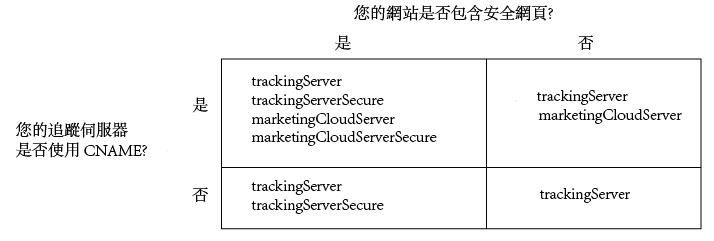

# 實作適用於 Analytics 的 Experience Cloud Identity Service{#implement-the-experience-cloud-id-service-for-analytics}

這些指示適用於想使用 Experience Cloud Identity Service 但不想使用 Dynamic Tag Management (DTM) 的 Analytics 客戶。不過，我們強烈建議您使用 DTM 來實作 ID 服務。DTM 可簡化實作工作流程，並自動確保程式碼放置和順序的正確性。

>[!IMPORTANT]
>
>* [先閱讀需求](../reference/requirements.md)，再開始使用。
>* 先在開發環境中設定與測試此程式碼，然後才在生產中實作。


請依照以下步驟實作 Adobe Analytics 的 ID 服務：

1. [下載 ID 服務程式碼](../implementation-guides/setup-analytics.md#section-ead9403a6b7e45b887f9ac959ef89f7f)
1. [將 Visitor.getInstance 函數新增至 ID 服務程式碼](../implementation-guides/setup-analytics.md#section-6053a6b7c16c466a9f9fdbf9cb9db3df)
1. [將您的 Experience Cloud 組織 ID 新增至 Visitor.getInstance](../implementation-guides/setup-analytics.md#section-7b8a6e76dc124d0e9ab1ce96ab2ffb0e)
1. [將追蹤伺服器新增至 Visitor.getInstance](../implementation-guides/setup-analytics.md#section-70ec9ebff47940d8ab520be5ec4728c5)
1. [更新您的 AppMeasurement.js 或 s_code.js 檔案](../implementation-guides/setup-analytics.md#section-b53113aea1bd4de896e0e4e9a7edee19)
1. [將訪客 API 程式碼新增至頁面](../implementation-guides/setup-analytics.md#section-d46d6aa324c842f2931d901e38d6db1d)
1. [(選用) 設定寬限期](../implementation-guides/setup-analytics.md#section-7bbb2f72c26e4abeb8881e18366797a3)
1. [測試並部署 ID 服務程式碼](../implementation-guides/setup-analytics.md#section-e9c1764ac21a4ec5be1ff338c0e2e01b)

## 步驟 1：下載 ID 服務程式碼 {#section-ead9403a6b7e45b887f9ac959ef89f7f}

[!UICONTROL ID 服務]需要 `VisitorAPI.js` 程式碼程式庫。若要下載此程式碼程式庫：

1. 前往&#x200B;**[!UICONTROL 管理]** > **[!UICONTROL 代碼管理器]**。
1. 在[!UICONTROL 代碼管理器]中，按一下 **[!UICONTROL JavaScript (新)]** 或 **[!UICONTROL JavaScript (舊)]**。

   即會下載壓縮的程式碼程式庫。

1. 解壓縮程式碼檔案，並開啟 `VisitorAPI.js` 檔案。

## 步驟 2：將 Visitor.getInstance 函數新增至 ID 服務程式碼 {#section-6053a6b7c16c466a9f9fdbf9cb9db3df}

>[!IMPORTANT]
>
>* 舊版 ID 服務 API 將此函數放置在不同的位置，且需要不同的語法。如果您要從 [1.4 版](../release-notes/notes-2015.md#section-f5c596f355b14da28f45c798df513572)之前的版本移轉，請留意此處說明的新位置和語法。
>* ALL CAPS 中的程式碼是實際值的預留位置。請將此文字取代為您的組織 ID、追蹤伺服器 URL 或其他指定值。


**第 1 部分：複製下方的 Visitor.getInstance 函數**

```js
var visitor = Visitor.getInstance("INSERT-MARKETING-CLOUD-ORGANIZATION-ID-HERE", { 
     trackingServer: "INSERT-TRACKING-SERVER-HERE", // same as s.trackingServer 
     trackingServerSecure: "INSERT-SECURE-TRACKING-SERVER-HERE", // same as s.trackingServerSecure 
 
     // To enable CNAME support, add the following configuration variables 
     // If you are not using CNAME, DO NOT include these variables 
     marketingCloudServer: "INSERT-TRACKING-SERVER-HERE", 
     marketingCloudServerSecure: "INSERT-SECURE-TRACKING-SERVER-HERE" // same as s.trackingServerSecure 
}); 
```

**第 2 部分：將函數程式碼新增至 VisitorAPI.js 檔案**

將 `Visitor.getInstance` 函數放置在程式碼區塊之後的檔案結尾。完成編輯的檔案應該如下所示：

```js
/* 
========== DO NOT ALTER ANYTHING BELOW THIS LINE ========== 
Version and copyright section 
*/ 
 
// Visitor API code library section 
 
// Put Visitor.getInstance at the end of the file, after the code library

var visitor = Visitor.getInstance("INSERT-MARKETING-CLOUD-ORGANIZATION-ID-HERE", { 
     trackingServer: "INSERT-TRACKING-SERVER-HERE", // same as s.trackingServer 
     trackingServerSecure: "INSERT-SECURE-TRACKING-SERVER-HERE", // same as s.trackingServerSecure 
 
     // To enable CNAME support, add the following configuration variables 
     // If you are not using CNAME, DO NOT include these variables 
     marketingCloudServer: "INSERT-TRACKING-SERVER-HERE", 
     marketingCloudServerSecure: "INSERT-SECURE-TRACKING-SERVER-HERE" // same as s.trackingServerSecure 
}); 
```

## 步驟 3：將您的 Experience Cloud 組織 ID 新增至 Visitor.getInstance {#section-7b8a6e76dc124d0e9ab1ce96ab2ffb0e}

在 `Visitor.getInstance` 函數中，將 `INSERT-MARKETING-CLOUD-ORGANIZATION ID-HERE` 取代為 [!DNL Experience Cloud] 組織 ID。如果您不知道組織 ID，可以在 [!DNL Experience Cloud] 管理頁面中找到。另請參閱[管理 - 核心服務](https://docs.adobe.com/content/help/zh-Hant/core-services/interface/manage-users-and-products/admin-getting-started.html)。您編輯的函數看起來可能類似於下列範例。

`var visitor = Visitor.getInstance("1234567ABC@AdobeOrg", { ...`

>[!IMPORTANT]
>
>*請勿*&#x200B;變更組織 ID 中的字元大小寫。ID 區分大小寫，需如實使用。

## 步驟 4：將追蹤伺服器新增至 Visitor.getInstance {#section-70ec9ebff47940d8ab520be5ec4728c5}

追蹤伺服器用於 [!DNL Analytics] 資料收集。

**第 1 部分：尋找您的追蹤伺服器 URL**

檢查 `s_code.js` 或 `AppMeasurement.js` 檔案，以尋找追蹤伺服器 URL。您想根據下列變數指定 URL：

* `s.trackingServer`
* `s.trackingServerSecure`

**第 2 部分：設定追蹤伺服器變數**

若要確認所應使用的追蹤伺服器變數：

1. 回答下列決策對照表中的問題。請使用與您的答案相對應的變數。
1. 將追蹤伺服器預留位置取代為您的追蹤伺服器 URL。
1. 將未使用的追蹤伺服器與 [!DNL Experience Cloud] 伺服器變數從程式碼中移除。



>[!NOTE]
>
>使用時，請將 [!DNL Experience Cloud] 伺服器 URL 與其對應的追蹤伺服器 URL 配對，如下所示：
>
>* [!DNL Experience Cloud] 伺服器 URL = 追蹤伺服器 URL
>* [!DNL Experience Cloud] 伺服器安全 URL = 追蹤伺服器安全 URL


若不清楚如何尋找您的追蹤伺服器，請參閱[常見問題集](../faq-intro/faq.md)和[正確填入 trackingServer 及 trackingServerSecure 變數](https://helpx.adobe.com/tw/analytics/kb/determining-data-center.html#)。

## 步驟 5：更新您的 AppMeasurement.js 或 s_code.js 檔案 {#section-b53113aea1bd4de896e0e4e9a7edee19}

將此函數新增至 `AppMeasurement.js` 或 `s_code.js` 檔案：

`s.visitor = Visitor.getInstance("INSERT-MARKETING-CLOUD-ORGANIZATION ID-HERE");`

將程式碼放置在包含設定的相同區段 (例如 `trackDownloads`、`linkInternalFilters`、`charSet` 等)。

***(可選用，但建議使用)*建立自訂 Prop **

在 `AppMeasurement.js` 或 `s_code.js` 中設定自訂 prop，以測量涵蓋範圍.將此自訂 Prop 新增至 `doPlugins` 或 `AppMeasurement.js` 檔案的 `s_code.js` 函數：

```js
// prop1 is used as an example only. Choose any available prop. 
s.prop1 = (typeof(Visitor) != "undefined" ? "VisitorAPI Present" : "VisitorAPI Missing");
```

## 步驟 6：將訪客 API 程式碼新增至頁面 {#section-d46d6aa324c842f2931d901e38d6db1d}

將 `VisitorAPI.js` 檔案放入每個頁面的 `<head>` 標籤中。將 `VisitorAPI.js` 檔案放到頁面中時：

* 放在 `<head>` 區段的開頭處，使其出現在其他解決方案標籤的前面。
* 必須在 AppMeasurement 及其他 [!DNL Experience Cloud] 解決方案的程式碼之前執行此檔案。

測試並驗證之後，將程式碼移至生產環境。

## 步驟 7：(選用) 設定寬限期 {#section-7bbb2f72c26e4abeb8881e18366797a3}

若其中有任何使用案例適用於您的情況，請要求[客戶服務](https://helpx.adobe.com/tw/marketing-cloud/contact-support.html)設定暫時的[寬限期](../reference/analytics-reference/grace-period.md)。寬限期最多可達 180 天。如有必要，您可以更新寬限期。

**部分實作**

如果部分頁面使用 ID 服務，部分頁面未使用，且這些頁面全部都向相同的 [!DNL Analytics] 報表套裝報告，則您需要寬限期。如果您有跨網域報告的全域報告套裝，就常會有此需要。

在所有向相同報告套裝報告的網頁上部署 ID 服務後，請停止寬限期。

**s_vi Cookie 需求**

如果您要求新訪客在移轉至 ID 服務後必須要有 s_vi Cookie，則需要寬限期。如果實作讀取 s_vi Cookie 並將其儲存在變數中，這個情況是很常見的。

當您的實作可擷取 MID，而非讀取 s_vi Cookie 之後，則可停止寬限期。

請參閱 [Cookie 與 Experience Cloud Identity Service](../introduction/cookies.md)。

如果您將資料從點擊流資料資料源傳送至內部系統，而且該程序使用 `visid_high` 和 `visid_low` 欄位，則需要寬限期。

您的資料擷取程序可使用 `post_visid_high` 和 `post_visid_low` 欄之後，即可停止寬限期。

請參閱[點按流資料欄參考](https://docs.adobe.com/content/help/zh-Hant/analytics/export/analytics-data-feed/data-feed-overview.html)。

**點擊流 (Clickstream) 資料擷取**

## 步驟 8：測試並部署 ID 服務程式碼 {#section-e9c1764ac21a4ec5be1ff338c0e2e01b}

您可以依照以下流程進行測試和部署。

**測試和驗證**

若要測試您的 ID 服務實作，請檢查：

* [AMCV Cookie](../introduction/cookies.md)，位於託管頁面的網域中。
* [!DNL Analytics] 影像請求中的 MID 值 (使用 [Adobe 偵錯工具](https://docs.adobe.com/content/help/zh-Hant/analytics/implementation/validate/debugger.html))。

請參閱[測試及驗證 Experience Cloud Identity Service](../implementation-guides/test-verify.md)。

**部署程式碼**

在程式碼通過測試後加以部署。

如果您在[步驟 7](../implementation-guides/setup-analytics.md#section-7bbb2f72c26e4abeb8881e18366797a3) 中啟用了寬限期：

* 請確保 [!DNL Analytics] ID (AID) 與 MID 位於影像請求中。
* 當您符合中止條件時，請記得停用寬限期。
