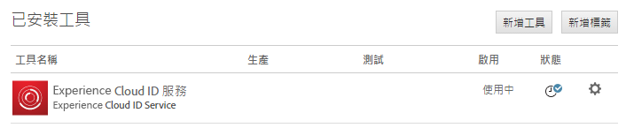
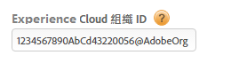
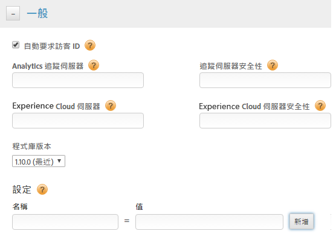
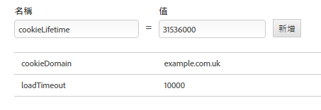
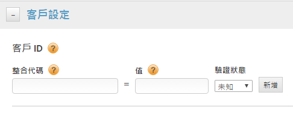

# 透過 Dynamic Tag Management 來實作 {#implementation-with-dynamic-tag-management}

較舊的實作會使用 Dynamic Tag Management (DTM) 來設定及部署 Experience Cloud ID 服務，並將 Experience Cloud Identity Service 與其他 Experience Cloud 解決方案整合。

## 透過 Dynamic Tag Management 來實作 {#topic-6f4ed5d96977406ca991e50f3fbd5b01}

較舊的實作會使用 Dynamic Tag Management (DTM) 來設定及部署 Experience Cloud ID 服務，並將 Experience Cloud Identity Service 與其他 Experience Cloud 解決方案整合。

>[!NOTE]
>
>目前 [Adobe Experience Platform Launch](https://experienceleague.adobe.com/docs/launch/using/home.html?lang=zh-Hant) 是慣用且建議的實作工具，因為其具備 DTM 缺乏的功能，可協助簡化複雜的標籤管理工作，並將程式碼放置作業自動化。請參閱[使用 Launch 實作](../implementation-guides/ecid-implement-with-launch.md)。

## Dynamic Tag Management 和 ID 服務 {#section-4a4c4fac5d0a4cbbaff8e1833f73657c}

[動態標籤管理](https://experienceleague.adobe.com/docs/dtm/using/dtm-home.html?lang=zh-Hant)可讓您設定、部署並管理識別碼服務執行個體和相關的 [!DNL Experience Cloud] 解決方案整合。DTM 可與 ID 服務及其他 Experience Cloud 解決方案深入整合，因此有助於簡化實作程序。請直接新增及設定 Experience Cloud ID 工具並指定資訊，例如:

* Experience Cloud 組織 ID (如果連結至 Experience Cloud，則會自動填入)
* Analytics 追蹤伺服器 (安全和非安全)
* Experience Cloud 伺服器 (用於第一方追蹤伺服器)

DTM 免費提供給所有 [!DNL Experience Cloud] 客戶使用。

**DTM 快速入門**

DTM 是簡單但功能強大的工具。如果您尚未使用，強烈建議您加以使用。請參閱 [DTM 文件](https://experienceleague.adobe.com/docs/dtm/using/c-overview.html?lang=zh-Hant)，以開始使用此服務。如需使用 DTM 設定 ID 服務的相關指示，請參閱以下章節中的資訊和程序。

## 部署準則 {#concept-54a2ec49af8f4bfca9207b1d404e8e1a}

開始嘗試透過 Dynamic Tag Management (DTM) 實作 Experience Cloud Identity Service 前，請先檢閱這些需求和程序。

<!--
mcvid-dtm-deployment.xml
-->

**佈建您的帳戶**

開始之前，請確定已針對 [!DNL Experience Cloud] 佈建組織和解決方案，而且您熟悉[!DNL Dyanamic Tag Management]。本文可協助您快速入門:

* [啟用核心服務的解決方案](https://experienceleague.adobe.com/docs/core-services/interface/about-core-services/core-services.html?lang=zh-Hant)：實作 Experience Cloud 並成為管理員。此程序會針對核心服務 (例如客戶屬性和 Experience Cloud 受眾) 導入最新的解決方案。
* [動態標籤管理快速入門](https://experienceleague.adobe.com/docs/dtm/using/getting-started/get-started.html?lang=zh-Hant)

**ID 服務程式碼放置和載入順序**

ID 服務的運作方式是向 [!DNL Adobe] 資料收集伺服器要求和接收唯一 ID。為了正常運作，您的 ID 服務程式碼必須是:

* 頁面上執行之 [!DNL Adobe] 程式碼的第一個區塊。
* 盡可能放置在頁面最高處，通常位在 `<head>` 程式碼區塊中。

只要您在 DTM 中維護所有的 [!DNL Adobe] 解決方案和程式碼程式庫，就能確保您的 ID 服務程式碼放置在正確位置並於正確時間觸發。

**驗證地區資料收集**

客戶必須提供 CNAME 或使用 `*.sc.omtrdc` 來進行[地區資料收集](https://experienceleague.adobe.com/docs/analytics/technotes/rdc/regional-data-collection.html?lang=zh-Hant) (RDC)。向 [!DNL Adobe] 顧問索取專屬的 RDC 設定。

**設定 Analytics 報表套裝**

新 [!DNL Analytics] 客戶應為資料收集[建立報表套裝](https://experienceleague.adobe.com/docs/analytics/admin/manage-report-suites/new-report-suite/new-report-suite.html?lang=zh-Hant)。

## 使用 DTM 實作 Experience Cloud Identity Service {#task-a659cf19dea84ad48edabe0b72ef9f5c}

請依照這些步驟來透過 Dynamic Tag Management (DTM) 實作 ID 服務。

**必要條件**

* 啟用您的 [!DNL Experience Cloud] 解決方案並確認您擁有管理員權限。請參閱[啟用核心服務的解決方案](https://experienceleague.adobe.com/docs/core-services/interface/about-core-services/core-services.html?lang=zh-Hant)。

* 在 DTM 中建立 Web 屬性。請參閱 DTM 的[建立 Web 屬性](https://experienceleague.adobe.com/docs/dtm/using/admin/web-property.html?lang=zh-Hant)文件。

<!--
mcvid-dtm-implement.xml
-->

**實作步驟**&#x200B;若要使用 DTM 實作 ID 服務:

1. 在 DTM [!UICONTROL 控制面板]中，按一下您要使用的 Web 屬性。
1. 在您選定 Web 屬性的&#x200B;**[!UICONTROL 總覽]**&#x200B;標籤中，按一下&#x200B;**[!UICONTROL 新增工具]**。
1. 在&#x200B;**[!UICONTROL 工具類型]**&#x200B;清單中，按一下 **[!UICONTROL Experience Cloud Identity Service]**。

   >[!NOTE]
   >
   >此動作會使用您的組織 ID 填入 **[!UICONTROL Experience Clould 組織 ID]**&#x200B;方塊。如果 DTM 帳戶未連結至 [!DNL Experience Cloud]，您必須提供此 ID。若要連結帳戶，請參閱[在 Experience Cloud 中連結帳戶](https://experienceleague.adobe.com/docs/core-services/interface/manage-users-and-products/organizations.html?lang=zh-Hant)。如需如何找到組織 ID 的相關資訊，請參閱[需求](../reference/requirements.md#section-a02f537129a64ffbb690d5738d360c26)。

1. 在&#x200B;**[!UICONTROL 追蹤伺服器]**&#x200B;方塊中輸入追蹤伺服器的名稱。若不清楚如何尋找您的追蹤伺服器，請參閱[常見問題集](../faq-intro/faq.md)和[正確填入 trackingServer 及 trackingServerSecure 變數](https://helpx.adobe.com/tw/analytics/kb/determining-data-center.html#)。
1. 按一下&#x200B;**[!UICONTROL 建立工具]**&#x200B;和&#x200B;**[!UICONTROL 儲存變更]**。

   儲存後，ID 服務會設定為 DTM 中的工具。但此時尚無法使用。您的 DTM 工具還需要執行 DTM 發佈/核准程序，且您可能需要設定其他參數。如需可新增至 DTM 的其他參數相關資訊，請參閱 [DTM 的 Experience Cloud Identity Service 設定](../implementation-guides/standard.md#concept-fb6cb6a0e6cc4f10b92371f8671f6b59)。

## DTM 的 Experience Cloud Identity Service 設定 {#concept-fb6cb6a0e6cc4f10b92371f8671f6b59}

說明[!UICONTROL 組織 ID]、[!UICONTROL 一般]和[!UICONTROL 客戶設定]欄位，以及 [!DNL Experience Cloud] ID 服務使用這些欄位的方式。

<!--
mcvid-dtm-settings.xml
-->

## 如何找到這些設定？ {#section-c5b2d1c928944ae2b8565c1b182fe575}

您在 Dynamic Tag Management (DTM) 中新增並儲存 ID 服務做為工具後，就能使用這些設定。您也可按一下 DTM Web 屬性之[!UICONTROL 已安裝的工具]區段中的齒輪圖示，以存取這些設定。



## 組織 ID {#section-949b5a0d8af940558b04ff675cf53f77}

這是與您佈建之 [!DNL Experience Cloud] 公司關聯的必要 ID。組織是可讓管理員設定用戶、群組，以及控制 [!DNL Experience Cloud] 中單一登入存取的實體。組織 ID 是 24 個字元的英數字串，後面接著 (而且必須包含) @AdobeOrg。[!DNL Experience Cloud] 管理員可以在 [「Experience Cloud > 工具」](https://experienceleague.adobe.com/docs/core-services/interface/manage-users-and-products/admin-getting-started.html?lang=zh-Hant)中找到此 ID。



另請參閱 [Cookie 與 Experience Cloud Identity Service](../introduction/cookies.md)。

## 一般設定 {#section-071d358e40f84629a8901b893dd61392}

這些設定可讓您指定追蹤伺服器、程式碼版本以及新增其他變數。



下表列出並定義[!UICONTROL 一般]設定。

**自動要求訪客 ID**

若勾選此選項，Dynamic Tag Management 在載入使用 Experience Cloud Identity Service 的任何 Adobe 解決方案之前，都會自動呼叫 `getMarketingCloudVisitorID()` 方法。

請參閱 [getMarketingCloudVisitorID](../library/get-set/getmcvid.md)。

**Analytics 追蹤伺服器**

用於 Analytics 資料收集之追蹤伺服器的名稱。這是寫入影像要求和 Cookie 的網域 (例如 `http://site.omtrdc.net`)。

如果您不知道追蹤伺服器 URL，請查看 `s_code.js` 或 `AppMeasurement.js` 檔案。請利用 `s.trackingServer` 變數設定 URL。

請參閱 [ trackingServer](https://experienceleague.adobe.com/docs/analytics/implementation/vars/page-vars/page-variables.html?lang=zh-Hant) 和[正確填入 trackingServer 和 trackingServerSecure 變數](https://helpx.adobe.com/tw/analytics/kb/determining-data-center.html#)。

**追蹤伺服器安全**

用於 Analytics 資料收集之安全追蹤伺服器的名稱。這是寫入影像要求和 Cookie 的網域 (例如 `https://site.omtrdc.net`)。

如果您不知道追蹤伺服器 URL，請查看 `s_code.js` 或 `AppMeasurement.js` 檔案。請利用 `s.trackingServerSecure` 變數設定 URL。

請參閱 [ trackingServer](https://experienceleague.adobe.com/docs/analytics/implementation/vars/page-vars/page-variables.html?lang=zh-Hant) 和[正確填入 trackingServer 和 trackingServerSecure 變數](https://helpx.adobe.com/tw/analytics/kb/determining-data-center.html#)。

**Experience Cloud 伺服器**

如果您的公司使用第一方資料收集 (CNAME) 來在第三方內容中利用第一方 Cookie，請在這裡輸入追蹤伺服器 (例如 `http://metrics.company.com`)。

**Experience Cloud 伺服器安全性**

如果您的公司使用第一方資料收集 (CNAME) 來在第三方內容中利用第一方 Cookie，請在這裡輸入追蹤伺服器 (例如 `https://metrics.company.com`)。

**程式庫版本**

設定您想使用的 ID 服務程式碼程式庫的版本 (`VisitorAPI.js`)。您無法編輯這些功能表選項。

**設定**

這些欄位可讓您[新增函數變數](../library/function-vars/function-vars.md)，做為機碼值組。按一下&#x200B;**[!UICONTROL 新增]**，新增一或多個變數至 ID 服務實作。



>[!IMPORTANT]
>
>在此設定 `cookieDomain` 變數。若多部分的頂層網域在 URL 的最後 2 個部分有其中之一包含 2 個以上的字元，則需要此變數。請參閱上述連結中的「設定變數」文件。

## 客戶設定 {#section-238d1272c1504d148fe38fb0ae5d71c2}

可讓您新增整合代碼或已驗證狀態的其他欄位。



**整合代碼**

整合代碼是客戶提供的唯一 ID。整合代碼應包含您在 [!DNL Audience Manager] 中用來[建立資料來源](https://experienceleague.adobe.com/docs/audience-manager/user-guide/features/data-sources/manage-datasources.html?lang=zh-Hant#create-data-source)的值。

**值**

此值應為包含用戶 ID 的資料元素。資料元素是適用於動態值 (例如來自用戶端專屬內部系統的 ID) 的容器。

**驗證狀態**

根據訪客的驗證狀態 (例如登入、登出) 定義或識別訪客的選項。請參閱[客戶 ID 和驗證狀態](../reference/authenticated-state.md)。

## 測試及驗證 Experience Cloud Identity Service {#concept-644fdbef433b46ba9c0634ac95eaa680}

這些指示、工具和程序可協助您判斷 ID 服務是否正確運作。這些測試適用於一般的 ID 服務，以及不同的 ID 服務與 [!DNL Experience Cloud] 解決方案組合。

<!--
mcvid-test-verify.xml
-->

## 開始之前 {#section-b1e76ad552ed4eb793b6e521a55127d4}

開始測試及驗證 ID Service 前的重要須知。

**瀏覽器環境**

在一般瀏覽器工作階段中進行測試時，請在每次測試之前清除您的瀏覽器快取。

或者，您可以在匿名或無痕瀏覽器工作階段中測試 ID 服務。在匿名工作階段中，您不需要在每次測試前清除瀏覽器 Cookie 或快取。

**工具**

[Adobe 偵錯工具](https://experienceleague.adobe.com/docs/analytics/implementation/validate/debugger.html?lang=zh-Hant)和 [Charles HTTP Proxy](https://www.charlesproxy.com/) 可協助您判斷 ID 服務是否已設定為正確地搭配 Analytics 運作。本節中的資訊以 Adobe 偵錯工具和 Charles 所傳回的結果為基礎。不過，您當然可以使用最適合您的任何工具或偵錯工具。

## 使用 Adobe 偵錯工具進行測試 {#section-861365abc24b498e925b3837ea81d469}

如果您在 [!DNL Experience Cloud ID] 偵錯工具回應中看到 [!DNL Adobe] (MID)，代表您的服務整合已正確設定。請參閱 [Cookie 與 Experience Cloud Identity Service](../introduction/cookies.md)，以了解有關 MID 的資訊。

若要使用 [!DNL Adobe][ 偵錯工具驗證 ID 服務的狀態](https://experienceleague.adobe.com/docs/analytics/implementation/validate/debugger.html?lang=zh-Hant)：

1. 清除您的瀏覽器 Cookie，或開啟匿名瀏覽工作階段。
1. 載入包含 ID 服務程式碼的測試頁面。
1. 開啟 [!DNL Adobe] 偵錯工具。
1. 查看 MID 的結果。

## 了解 Adobe Debugger 的結果 {#section-bd2caa6643d54d41a476d747b41e7e25}

MID 儲存在使用下列語法的機碼-值組中：`MID= *`Experience Cloud ID`*`。偵錯工具會顯示此項資訊，如下所示。

**成功**

如果您看到類似以下的回應，代表 ID 服務已正確實作：

```
mid=20265673158980419722735089753036633573
```

如果您是 [!DNL Analytics] 客戶，則除了 MID，還可能看到 [!DNL Analytics] ID (AID)。此狀況發生於：

* 您的某些早期/長期網站訪客。
* 您已啟用寬限期時。

**失敗**

如果偵錯工具出現下列情況，請聯絡[客戶服務](https://helpx.adobe.com/tw/marketing-cloud/contact-support.html)：

* 未傳回 MID。
* 傳回錯誤訊息，指出您的合作夥伴 ID 尚未佈建。

## 使用 Charles HTTP Proxy 進行測試 {#section-d9e91f24984146b2b527fe059d7c9355}

若要使用 Charles 驗證 ID 服務的狀態：

1. 清除您的瀏覽器 Cookie，或開啟匿名瀏覽工作階段。
1. 啟動 Charles。
1. 載入包含 ID 服務程式碼的測試頁面。
1. 檢查請求和回應呼叫，和以下說明的資料。

## 了解 Charles 的結果 {#section-c10c3dc0bb9945cbaffcf6fec7082fab}

請參閱本節以了解當您使用 Charles 監視 HTTP 呼叫時，應至何處查看哪些項目。

### Charles 中的成功 ID 服務要求

當 `Visitor.getInstance` 函數對 `dpm.demdex.net` 進行 JavaScript 呼叫時，表示您的 ID 服務程式碼正常運作。成功的要求包含[組織 ID](../reference/requirements.md#section-a02f537129a64ffbb690d5738d360c26)。組織 ID 是以使用下列語法的機碼-值組來傳遞：`d_orgid= *`organization ID`*`。查看 `dpm.demdex.net`Structure[!UICONTROL  標籤下方的 ] 和 JavaScript 呼叫。查看 [!UICONTROL Request] 標籤下方的組織 ID。


### Charles 中的成功 ID 服務回應

當[資料收集伺服器](https://experienceleague.adobe.com/docs/audience-manager/user-guide/reference/system-components/components-data-collection.html?lang=zh-Hant) (DCS) 的回應傳回 MID 時，表示您的帳戶已正確佈建。MID 是以使用此語法的機碼值組傳回：`d_mid: visitor Experience Cloud ID`。查看 [!UICONTROL Response] 標籤中的 MID，如下所示。


### Charles 中的失敗 ID 服務回應

如果 DCS 回應中缺少 MID，表示您的帳戶未正確佈建。失敗的回應會在[!UICONTROL 回應]標籤中傳回錯誤碼和訊息，如下所示。如果您在 DCS 回應中看到這個錯誤訊息，請聯絡客戶服務。


如需有關錯誤碼的詳細資訊，請參閱 [DCS 錯誤碼、訊息與範例](https://experienceleague.adobe.com/docs/audience-manager/user-guide/api-and-sdk-code/dcs/dcs-api-reference/dcs-error-codes.html?lang=zh-Hant)。

>[!MORELIKETHIS]
>
>* [Web 屬性](https://experienceleague.adobe.com/docs/dtm/using/admin/web-property.html?lang=zh-Hant)

