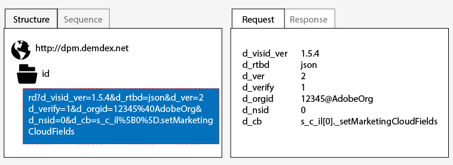
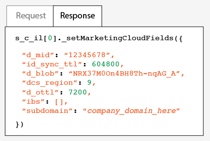

# 測試及驗證Adobe訪客ID服務{#test-and-verify-the-experience-cloud-id-service}

這些指示、工具和程式可協助您判斷訪客ID服務是否正常運作。 這些測試適用於一般訪客ID服務，以及不同的訪客ID服務與CX Enterprise解決方案組合。

## 開始之前 {#section-b1e76ad552ed4eb793b6e521a55127d4}

開始測試及驗證訪客ID服務前的重要須知。

**瀏覽器環境**

在一般瀏覽器工作階段中進行測試時，請在每次測試之前清除您的瀏覽器快取。

或者，您可以在匿名或無痕瀏覽器工作階段中測試訪客ID服務。 在匿名工作階段中，您不需要在每次測試前清除瀏覽器 Cookie 或快取。

**工具**

[Adobe Debugger](https://experienceleague.adobe.com/docs/analytics/implementation/validate/debugger.html?lang=zh-Hant)和[Charles HTTP Proxy](https://www.charlesproxy.com/)可協助您判斷訪客ID服務是否已設定為正確地搭配Analytics使用。 本節中的資訊以 Adobe 偵錯工具和 Charles 所傳回的結果為基礎。 不過，您當然可以使用最適合您的任何工具或偵錯工具。

## 使用 Adobe 偵錯工具進行測試 {#section-861365abc24b498e925b3837ea81d469}

如果您在Adobe Debugger回應中看到ECID，代表您的服務整合已正確設定。 如需有關MID的詳細資訊，請參閱[Cookie和訪客ID服務](../introduction/cookies.md)。

若要使用Adobe [偵錯工具驗證訪客ID服務的狀態](https://experienceleague.adobe.com/docs/analytics/implementation/validate/debugger.html?lang=zh-Hant)：

1. 清除您的瀏覽器 Cookie，或開啟匿名瀏覽工作階段。
1. 載入包含訪客ID服務程式碼的測試頁面。
1. 開啟Adobe Debugger。
1. 查看 MID 的結果。

## 了解 Adobe Debugger 的結果 {#section-bd2caa6643d54d41a476d747b41e7e25}

MID儲存在使用下列語法的機碼 — 值組中： `MID= *`ECID`*`。 偵錯工具會顯示此項資訊，如下所示。

**成功**

如果您看到類似以下的回應，代表訪客ID服務已正確實作：

```
mid=20265673158980419722735089753036633573
```

如果您是Analytics客戶，則除了MID，還可能看到Analytics ID (AID)。 此狀況發生於：

* 您的某些早期/長期網站訪客。
* 您已啟用寬限期時。

**失敗**

如果偵錯工具出現下列情況，請聯絡[客戶服務](https://helpx.adobe.com/tw/marketing-cloud/contact-support.html)：

* 未傳回 MID。
* 傳回錯誤訊息，指出您的合作夥伴 ID 尚未佈建。

## 使用 Charles HTTP Proxy 進行測試 {#section-d9e91f24984146b2b527fe059d7c9355}

若要使用Charles驗證訪客ID服務的狀態：

1. 清除您的瀏覽器 Cookie，或開啟匿名瀏覽工作階段。
1. 啟動 Charles。
1. 載入包含訪客ID服務程式碼的測試頁面。
1. 檢查請求和回應呼叫，和以下說明的資料。

## 了解 Charles 的結果 {#section-c10c3dc0bb9945cbaffcf6fec7082fab}

請參閱本節以了解當您使用 Charles 監視 HTTP 呼叫時，應至何處查看哪些項目。

Charles中的&#x200B;**成功的訪客ID服務要求**

當`Visitor.getInstance`函式對`dpm.demdex.net`進行JavaScript呼叫時，您的訪客ID服務程式碼正常運作。 成功的要求包含您的[IMS組織ID](../reference/requirements.md#section-a02f537129a64ffbb690d5738d360c26)。 IMS組織ID是以使用下列語法的機碼 — 值組來傳遞： `d_orgid= *`IMS組織ID`*`。 查看 `dpm.demdex.net` 標籤下方的 [!UICONTROL Structure] 和 JavaScript 呼叫。 在[!UICONTROL Request]標籤下方尋找您的IMS組織ID。



Charles中的&#x200B;**成功的訪客ID服務回應**

當[資料收集伺服器](https://experienceleague.adobe.com/docs/audience-manager/user-guide/reference/system-components/components-data-collection.html?lang=zh-Hant) (DCS)的回應傳回MID時，表示您的帳戶已正確布建為訪客ID服務。 MID是以使用下列語法的機碼 — 值組傳回： `d_mid: *`訪客ECID`*`。 查看 [!UICONTROL Response] 標籤中的 MID，如下所示。



Charles中的&#x200B;**失敗的訪客ID服務回應**

如果 DCS 回應中缺少 MID，表示您的帳戶未正確佈建。 失敗的回應會在 [!UICONTROL Response] 標籤中傳回錯誤碼和訊息，如下所示。 如果您在 DCS 回應中看到這個錯誤訊息，請聯絡客戶服務。


如需有關錯誤碼的詳細資訊，請參閱 [DCS 錯誤碼、訊息與範例](https://experienceleague.adobe.com/docs/audience-manager/user-guide/api-and-sdk-code/dcs/dcs-api-reference/dcs-error-codes.html?lang=zh-Hant)。

