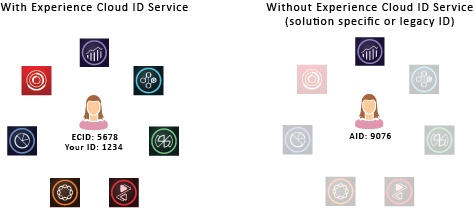

# 關於訪客ID服務{#aboutidservice}

訪客ID服務在Adobe CX Enterprise中的角色。

<!--
mcvid-functionality.xml
-->

## 訪客ID服務：核心服務的基本要素 {#section-2de0eb1d65664e92a4d8bbb167b84bde}

訪客ID服務可為CX Enterprise核心服務、解決方案以及客戶屬性和觀眾啟用共同識別架構。 其運作方式為指派不重複的永久ID給網站訪客。 當貴組織實作訪客ID服務時，此ID可讓您在不同的CX Enterprise解決方案中識別相同的網站訪客及其資料。

此外，訪客ID服務也可以取代不同的解決方案專屬ID （例如Analytics AID）。 透過[客戶ID和驗證狀態](../reference/authenticated-state.md)功能，訪客ID服務可讓您將您的客戶ID傳遞至CX Enterprise。 不過請記住，訪客ID服務僅適用於您已訂閱的解決方案。 它無法讓您存取您尚未註冊的其他產品。

展望未來，訪客ID服務將成為許多目前與未來CX Enterprise特色、增強功能與服務的必要元件。 目前，訪客ID服務支援[Analytics](http://www.adobe.com/tw/marketing-cloud/web-analytics.html)、[Audience Manager](http://www.adobe.com/tw/marketing-cloud/data-management-platform.html)和[Target](http://www.adobe.com/tw/marketing-cloud/testing-targeting.html)。 此外，如果您想參與Adobe Device Co-op，也需要用到ID服務。 如果您尚未實作訪客ID服務，現在就是開始考慮移轉策略的最佳時機。

## 功能摘要 {#section-96555473455c4bf8924c2d56ff4f3255}

總而言之，訪客ID服務：

* 建立可用來連結輪廓和身分識別的公用鍵或 ID。
* 可唯一識別多個解決方案中的裝置。
* 設定客戶網域中的第一方 Cookie，以確保在相同的網域上追蹤。 請參閱[Cookie和訪客ID服務](../introduction/cookies.md)。
* 從CX Enterprise客戶和合作夥伴接收別名和ID對應。
* 管理CX Enterprise內的ID同步。
* 在各廣告技術生態系統中，支援不同第三方的 ID 同步。

