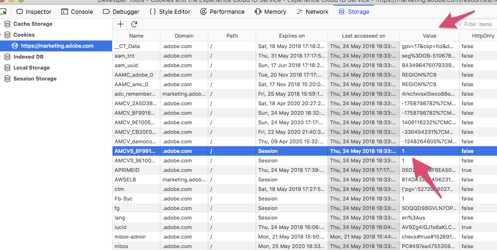

# Cookie 與 Experience Cloud Identity 服務{#cookies-and-the-experience-cloud-id-service}

ID 服務使用您的組織 ID、Experience Cloud AMCV Cookie 及 Demdex Cookie，為您的網站訪客建立並儲存不重複的永久識別碼。這些 Cookie 可以讓 ID 服務追蹤您不同網域上的訪客，並且讓您在不同的 Experience Cloud 解決方案間共用資料。

## 瞭解 ID 服務 Cookie {#section-f438168beaec409ab8b2cc58bd021e26}

ID服務需仰賴AMCV、AMCVS和Demdex Cookie才能正常運作。 這些Cookie只是儲存ID服務所使用資料的檔案。 這些ID服務Cookie與網站或服務在瀏覽器中儲存的其他第一方或第三方Cookie並無危險、惡意或不同，且遵循的規則與其他第一方和第三方Cookie相同。 請參考下方各節以取得 ID 服務所使用 Cookie 的更多資訊。

### ID 服務 Cookie 具備的功能

* 設定並儲存網站訪客的唯一ID(MID)。
* 保留此唯一ID，讓ID服務可以收集資料並與其他Experience Cloud解決方案共用。
* 跨網域追蹤使用者。 但是，這需要您擁有其他網域，並在網域上部署ID服務程式碼。

### ID 服務 Cookie 不具備的功能

* 儲存、傳輸或執行電腦病毒。
* 存取或儲存個人識別資訊 (PII)，例如: 您的電子郵件地址。
* 控制電腦硬體或軟體。
* 使電腦不穩定或導致效能問題。
* 追蹤未使用ID服務之網站的使用者。

## AMCV Cookie {#section-c55af54828dc4cce89f6118655d694c8}

下列 Cookie 屬性由 ID 服務設定。

**名稱**

AMCV Cookie 名稱遵循以下語法: `AMCV_<variable name>@AdobeOrg`。在名稱中，`<variable name>` 元素是 Experience Cloud 組織 ID 部分的預留位置。此 ID 會由 ID 服務程式碼中的 `Visitor.getInstance` 函數傳遞至 DCS。

完整格式的 Cookie 名稱類似以下:

```
AMCV_1FD6776A524453CC0A490D44%40AdobeOrg
```

**內容**

AMCV Cookie包含Experience Cloud訪客ID或MID。 MID 儲存在遵循下列語法的機碼-值組中: `mid|<Experience Cloud ID>`。

完整格式的機碼值組類似以下:

```
mid|20265673158980419722735089753036633573
```

此永續性識別碼可讓跨解決方案資料共用。

**網域**

AMCV Cookie是在瀏覽器的第一方網域中設定。 這表示它是在使用者目前造訪之網站的網域中設定。 因此，ID服務程式碼和其他Experience Cloud程式碼程式庫可讀取儲存在AMCV Cookie中的MID。

不過，由於AMCV Cookie是在第一方網域中設定，因此無法用來追蹤和識別不同網域的使用者。 相反地，當網站訪客導覽至不同網域時，ID服務會依賴組織ID和Demdex ID傳回正確的MID。

## AMCVS Cookie {#section-92a9454f1ac645948f9059b9fad928bf}

**名稱**

AMCVS Cookie 名稱會遵循 `AMCVS_####@AdobeOrg` 語法。在名稱中，#### 元素是 Experience Cloud 組織 ID 部分的預留位置。此 ID 會由 ID 服務程式碼中的 `theVisitor.getInstance` 函數傳入 DCS。

完整格式的 Cookie 名稱類似以下:

```
AMCVS_1FD6776A524453CC0A490D44%40AdobeOrg
```

**內容**

AMCVS Cookie會作為指示已初始化作業的旗標。 其值一律為 `1`，直到工作階段結束為止。

**網域**

AMCVS Cookie是在瀏覽器的第一方網域中設定。 這表示它是在使用者目前造訪之網站的網域中設定。



## Demdex Cookie {#section-7ff7d96d6e4141b08a84a75a63d7814c}

下表列出並定義Demdex Cookie的某些重要屬性。

<table id="table_18E3CAF3550E4BB6A199736AACE39202"> 
 <thead> 
  <tr> 
   <th colname="col1" class="entry"> 屬性 </th> 
   <th colname="col2" class="entry"> 說明 </th> 
  </tr> 
 </thead>
 <tbody> 
  <tr> 
   <td colname="col1"> <p> <b>名稱</b> </p> </td> 
   <td colname="col2"> <p>Cookie名稱為「demdex」。 </p> </td> 
  </tr> 
  <tr> 
   <td colname="col1"> <p> <b>內容</b> </p> </td> 
   <td colname="col2"> <p>Demdex Cookie包含由DCS產生的Demdex ID。 </p> </td> 
  </tr> 
  <tr> 
   <td colname="col1"> <p> <b>網域</b> </p> </td> 
   <td colname="col2"> <p>Demdex Cookie是在瀏覽器的第三方demdex.net網域中設定。 此網域與使用者目前造訪的網站不同。 </p> <p>與第一方不同，AMCV Cookie、Demdex Cookie和ID會持續存在於不同的網域。 Demdex ID和您的組織ID是允許ID服務傳回並識別具有正確訪客ID的網站訪客的通用值。 </p> </td> 
  </tr> 
 </tbody> 
</table>

如需相關資訊，請參閱[瞭解向 Demdex 網域進行的呼叫](https://docs.adobe.com/content/help/zh-Hant/audience-manager/user-guide/reference/demdex-calls.html)。

## 產生 Experience Cloud ID {#section-15f69c0bac394b4b9966a23fbc586d17}

Experience Cloud ID (MID) 是依照組織 ID 和 demdex ID 利用數學公式計算出來。只要這些ID保持不變，為特定使用者產生正確的MID就只是數學問題。 使用相同的組織ID和Demdex ID，您每次都會獲得相同的MID值。 這可讓ID服務追蹤您控制並設定ID服務程式碼的網域訪客。

當頁面載入時，ID服務會開始建立MID。 在此過程中，`visitorAPI.js` 程式碼資料庫提供的程式碼會將您的組織 ID 以事件呼叫的形式傳送至 ID 服務。ID 服務分別在 AMCV 與 Demdex Cookie 中，建立並回傳 MID 與 Demdex ID。

## Cookie 標幟

下表說明 Experience Cloud Cookie 的標幟:

| Cookie (設定者) | httpOnly | Secure | SameSite |
|--- |--- |--- |--- |
| demdex (http 回應) | 無 | 是 | &quot;無&quot; |
| AMCV (Javascript) | 無 | 可設定 | 未設定 (預設為 Lax) |
| AMCVS (Javascript) | 無 | 可設定 | 未設定 (預設為 Lax) |

*注意: 如需使用安全屬性設定 AMCV 和 AMCVS Cookie 的相關資訊，請參閱[secureCookie](https://docs.adobe.com/content/help/en/id-service/using/id-service-api/configurations/securecookie.html)主題。*

## 下一步 {#section-8db1727a63bc4ff68b495f270315d453}

請參閱 [Experience Cloud Identity 服務如何要求與設定 ID...](../introduction/id-request.md#concept-2caacebb1d244402816760e9b8bcef6a)。
