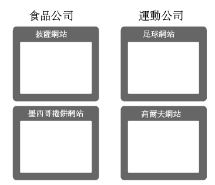
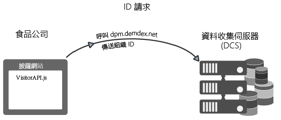
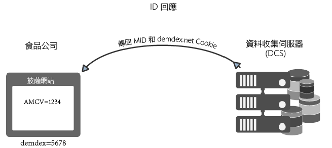
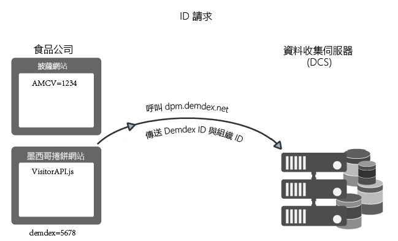
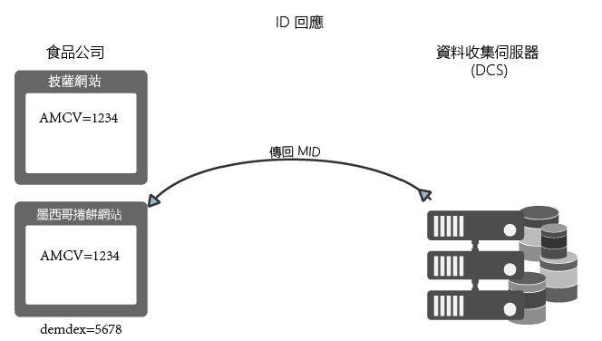
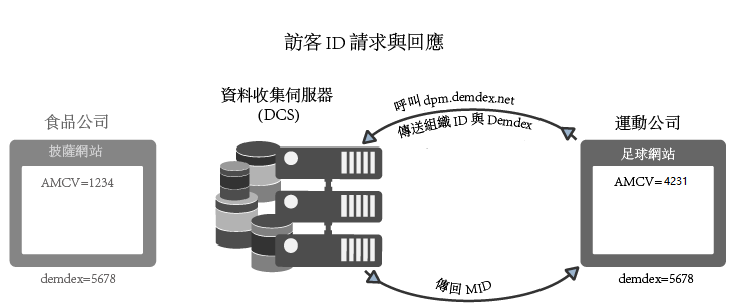

# Experience Cloud Identity Service 如何請求與設定 ID{#how-the-experience-cloud-id-service-requests-and-sets-ids}

ID 請求與回應程序的概述。這些範例涵蓋在個別網站、跨不同網站，以及針對由不同 Experience Cloud 客戶 (具有自己的組織 ID) 管理的網站，進行 ID 指派。

>[!NOTE]
>
>如果您不熟悉 Experience Cloud Identity Service 建立訪客 ID 的方式，請先花點時間檢閱 [Experience Cloud](../introduction/cookies.md)。

**秘訣：**&#x200B;另請參閱我們的 [ID 服務跨網域追蹤影片](https://helpx.adobe.com/tw/marketing-cloud-core/kb/MCID/CrossDomain.html)。

## 請求 Experience Cloud ID {#section-0b5e261fbd0547d9b9a1680e5ce536cc}

下列範例示範 ID 服務請求和接收 Experience Cloud 訪客 ID 的方式。這些範例使用食品公司和運動公司這兩家虛構公司來示範 ID 要求和回應的資料流程。每間公司都有獨特的 Experience Cloud 組織 ID，並且已經在所有公司網站上實作 ID 服務程式碼。這些使用案例會呈現在未使用 Analytics、舊有 ID 或封鎖第三方 Cookie 的瀏覽器的情況下，一般 ID 服務實作的資料流程。

**第一個要求**

在此範例中，有一名新訪客進入食品公司所管理的披薩網站。食品公司在披薩網站上有 ID 服務程式碼。當披薩網站載入時，ID 服務程式碼會檢查披薩網域中是否有 AMCV Cookie。

* 如果已設定 AMCV Cookie，網站訪客即會有 Experience Cloud ID。在此情況下，Cookie 會追蹤訪客並與其他 Experience Cloud 解決方案共用資料。
* 如果未設定AMCV Cookie,ID服務程式碼會呼叫位於`dpm.demdex.net/id`的區域[資料收集伺服器](https://experienceleague.adobe.com/docs/analytics/technotes/rdc/regional-data-collection.html?lang=en)(DCS)（另請參閱[了解向Demdex網域進行的呼叫](https://experienceleague.adobe.com/docs/audience-manager/user-guide/reference/demdex-calls.html?lang=en)）。 此呼叫包括食品公司的組織 ID。組織 ID 是在 ID 服務程式碼的 `Visitor.getInstance` 函數中設定。

**第一個回應**

回應時，DCS 傳回 [!DNL Experience Cloud] ID (MID) 和 Demdex Cookie。ID 服務程式碼會將 MID 值寫入至 AMCV Cookie。例如，假設 DCS 傳回 MID 值 1234。AMCV Cookie 將會儲存為 `mid|1234`，並在第一方披薩網域中設定。Demdex Cookie也包含唯一 ID (我們將其命名為 5678)。此 Cookie 設定於第三方 demdex.net 網域中，與披薩網域分開。

您可以在下個範例中看到，當我們的訪客移至食品公司所屬的其他網站時，Demdex ID 和組織 ID 可讓 ID 服務建立正確的 MID 並加以傳回。

## 跨網站要求和回應 {#section-15ea880453af467abd2874b8b4ed6ee9}

在此範例中，我們的食品公司訪客從披薩網站瀏覽至墨西哥卷餅網站。食品公司在墨西哥卷餅網站上有 ID 服務程式碼。該訪客從未造訪過墨西哥卷餅網站。

基於這些條件，墨西哥卷餅網站上並沒有 AMCV Cookie。此外，ID 服務無法使用披薩網站上設定的 AMCV Cookie，因為這是披薩網域專屬的 Cookie。因此，ID 服務必須呼叫 DCS 以檢查並請求訪客 ID。在此案例中，DCS 呼叫包含食品公司的組織 ID *和* Demdex ID。同時請留意，Demdex ID 擷取自披薩網站，並儲存為 demdex.net 網域下的第三方 Cookie。

DCS 在收到組織 ID 和 Demdex ID 後，會為我們的網站訪客建立正確的 MID 並加以傳回。由於 是以數學方式從組織 ID 和 Demdex ID 計算得來，因此 AMCV Cookie 包含 MID 值 `mid = 1234`mid = 。

## 來自其他網站的 ID 要求 {#section-ba9a929e50d64b0aba080630fd83b6f1}

在此範例中，我們的訪客離開食品公司網站，並瀏覽至運動公司所屬的足球網站。當訪客造訪足球網站時，ID 檢查和請求程序的運作方式會與先前範例中說明的相同。不過，由於運動公司有其本身的組織 ID，因此 ID 服務會傳回不同的 MID。新的 MID 專屬於運動公司控管的網域，可讓企業在 [!DNL Experience Cloud] 的各解決方案中追蹤和共用訪客資料。該名訪客的 Demdex ID 仍維持不變，因為 Demdex ID 包含在第三方 Cookie 中，且會在不同網域中持續存在。

