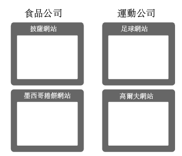
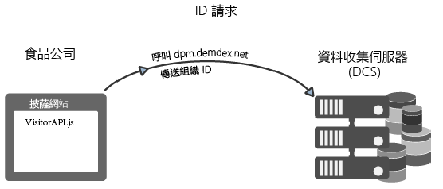
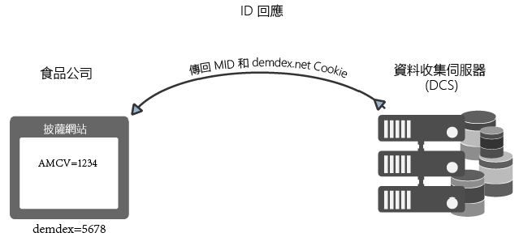
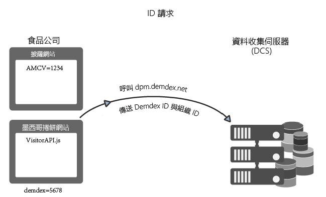
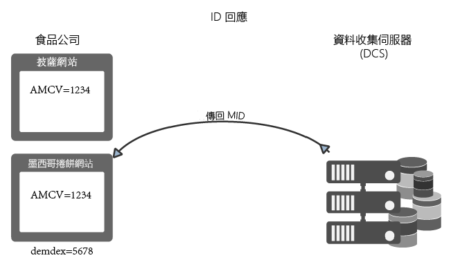
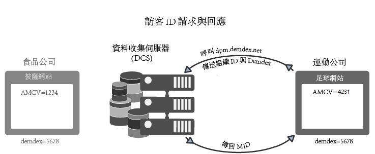

# Adobe訪客ID服務如何要求與設定ID{#how-the-experience-cloud-id-service-requests-and-sets-ids}

ID 請求與回應程序的概觀。 這些範例涵蓋在個別網站、跨不同網站，以及針對由不同CX Enterprise客戶（具有自己的IMS組織ID）管理的網站，進行ID指派。

>[!NOTE]
>
>如果您不熟悉訪客ID服務建立訪客ID的方式，請花點時間檢閱[Cookie和訪客ID服務](../introduction/cookies.md)。

## 請求ECID {#section-0b5e261fbd0547d9b9a1680e5ce536cc}

下列範例示範訪客ID服務如何要求與接收ECID。 這些範例使用食品公司和運動公司這兩家虛構公司來示範 ID 要求和回應的資料流程。 每間公司都有獨特的IMS組織ID，並已在其所有網站上實作訪客ID服務程式碼。 這些使用案例會呈現在未使用Analytics、舊有ID或封鎖第三方Cookie的瀏覽器的情況下，一般訪客ID服務實作的資料流程。

**第一個要求**

在此範例中，有一名新訪客進入食品公司所管理的披薩網站。 食品公司在披薩網站上設有訪客ID服務程式碼。 當披薩網站載入時，訪客ID服務程式碼會檢查披薩網域中是否有AMCV Cookie。

* 如果已設定AMCV Cookie，網站訪客即會有ECID。 在此情況下，Cookie會追蹤訪客並與其他CX企業解決方案共用資料。
* 如果未設定AMCV Cookie，訪客ID服務程式碼會呼叫位於`dpm.demdex.net/id`的區域[資料收集伺服器](https://experienceleague.adobe.com/docs/analytics/technotes/rdc/regional-data-collection.html?lang=zh-Hant) (DCS) （另請參閱[瞭解向Demdex網域進行的呼叫](https://experienceleague.adobe.com/docs/audience-manager/user-guide/reference/demdex-calls.html?lang=zh-Hant)）。 此呼叫包括食品公司的IMS組織ID。 IMS組織ID是在訪客ID服務程式碼的`Visitor.getInstance`函式中設定。

**第一個回應**

回應時，DCS傳回ECID和Demdex Cookie。 訪客ID服務程式碼會將MID值寫入AMCV Cookie。 例如，假設 DCS 傳回 MID 值 1234。 AMCV Cookie 將會儲存為 `mid|1234`，並在第一方披薩網域中設定。 Demdex Cookie也包含唯一 ID (我們將其命名為 5678)。 此 Cookie 設定於第三方 demdex.net 網域中，與披薩網域分開。

您可以在下個範例中看到，當我們的訪客移至食品公司所屬的其他網站時，Demdex ID和IMS組織ID可讓訪客ID服務建立正確的MID並加以傳回。

## 跨網站要求和回應 {#section-15ea880453af467abd2874b8b4ed6ee9}

在此範例中，我們的食品公司訪客從披薩網站瀏覽至墨西哥卷餅網站。 食品公司在墨西哥捲餅網站上設有訪客ID服務程式碼。 該訪客從未造訪過墨西哥卷餅網站。

基於這些條件，墨西哥卷餅網站上並沒有 AMCV Cookie。 此外，訪客ID服務無法使用此披薩網站上設定的AMCV Cookie，因為此服務是披薩網域專屬的。 因此，訪客ID服務必須呼叫DCS以檢查並請求訪客ID。 在此案例中，DCS呼叫包含食品公司的IMS組織ID *和* Demdex ID。 同時請留意，Demdex ID 擷取自披薩網站，並儲存為 demdex.net 網域下的第三方 Cookie。

DCS在收到IMS組織ID和Demdex ID後，會為我們的網站訪客建立正確的MID並加以傳回。 因為是以數學方式從IMS組織ID和Demdex ID計算得來，所以AMCV Cookie包含MID值`mid = 1234`。

## 來自其他網站的 ID 要求 {#section-ba9a929e50d64b0aba080630fd83b6f1}

在此範例中，我們的訪客離開食品公司網站，並瀏覽至運動公司所屬的足球網站。 當訪客造訪足球網站時，ID 檢查和請求程序的運作方式會與先前範例中說明的相同。 不過，由於運動公司有其專屬的IMS組織ID，因此訪客ID服務會傳回不同的MID。 新的MID專屬於運動公司控管的網域，可讓企業在CX Enterprise的各解決方案中追蹤和共用訪客資料。 該名訪客的 Demdex ID 仍維持不變，因為 Demdex ID 包含在第三方 Cookie 中，且會在不同網域中持續存在。

