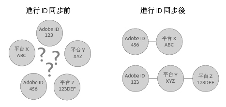

# 了解 ID 同步和匹配率{#understanding-id-synchronization-and-match-rates}

概述訪客ID服務（包括Adobe Media Optimizer和訪客ID服務）中的ID同步程式與匹配率。

## ID 同步和匹配率 {#section-f652aae7234945e89d26dd833c5215fb}

ID同步會將訪客ID服務所指派的ID比對到客戶指派給網站訪客的ID。 例如，假設訪客ID服務已指派訪客ID 1234。 另一個平台則以 ID 4321 識別此訪客。 訪客ID服務會在同步過程中將這兩個ID相互對應。 其結果會將新資料點新增至客戶對其網站訪客已知的部分。 此外，如果訪客ID服務無法比對出某個ID，系統會建立新的ID，並使用該ID進行日後的同步作業。

匹配率可測量及驗證 ID 同步程序的有效性。 高匹配率表示，特定服務將比低匹配率的服務更有效率，並且可供更多線上客群存取。 比較匹配率，是評估不同整合式廣告技術平台的量化方式。

**確保高匹配率**

正確的實作有助於確保高匹配率，因為可讓訪客ID服務設定其運作所需的Cookie，並將ID與已啟用的資料合作夥伴進行同步。 不過，網際網路連線、從行動裝置收集資料或無線網路速度緩慢等因素，都可能會影響訪客ID服務收集、同步及比對ID的效能。 這些使用者端變數不在訪客ID服務或Adobe的控制範圍之內。

## 描述的 ID 同步程序 {#section-a541a85cbbc74f5682824b1a2ee2a657}

訪客ID服務會即時同步ID。 此程序可在瀏覽器中運作，而不憑藉伺服器對伺服器的資料傳輸。 下表說明 ID 同步程序的步驟。

**步驟 1：載入頁面**

當訪客造訪您的網站並載入頁面時，`Visitor.getInstance`函式會向訪客ID服務發出[CORS](../reference/cors.md#concept-6c280446990d46d88ba9da15d2dcc758)或JSON-P呼叫。 訪客ID服務使用Cookie回應，其中包含訪客的ECID。 MID 是指派給每個網站訪客的唯一 ID。 另請參閱[Cookie和訪客ID服務](../introduction/cookies.md)。

**步驟 2：載入 iFrame**

載入頁面本文時，訪客ID服務會載入名為&#x200B;*`Destination Publishing iFrame`*&#x200B;的iFrame。 [!UICONTROL Destination Publishing iFrame] 會在不同於上層頁面的網域中載入。 此設計有助於確保頁面效能並提高安全性，因為 iFrame 會：

* 以與上層頁面非同步的方式載入。 這表示上層頁面可與 [!UICONTROL Destination Publishing iFrame] 分開載入。 載入 iFrame 以及從 iFrame 內載入 ID 同步像素，並不會影響到上層頁面或用戶體驗。
* 盡快載入。 如果速度太快，您可以在視窗載入事件之後載入 iFrame (不建議使用)。 請參閱 [idSyncAttachIframeOnWindowLoad](../library/function-vars/idsyncattachiframeonwindowload.md#reference-b86b7112e0814a4c82c4e24c158508f4) 了解詳細資訊。
* 防止 iFrame 中的程式碼存取或影響到上層頁面。

另請參閱[訪客ID服務如何要求與設定ID...](../introduction/id-request.md#concept-2caacebb1d244402816760e9b8bcef6a)。

**步驟 3：引發 ID 同步**

ID 同步是在 Destination Publishing iFrame 中引發的 URL。 如以下通用範例所示，ID同步URL包含合作夥伴的ID同步端點以及重新導向URL，這會重新導向回包含其ID的Adobe。

`http://abc.com?partner_id=abc&sync_id=123&redir=http://dpm.demdex.net/ibs:dpid=<ADOBE_PARTNER_ID>&dpuuid=<PARTNER_UUID>`

另請參閱[連入資料傳輸的 ID 同步](https://experienceleague.adobe.com/docs/audience-manager/user-guide/implementation-integration-guides/sending-audience-data/batch-data-transfer-process/id-sync-http.html?lang=zh-Hant)。

**步驟 4：儲存 ID**

同步的 ID 會儲存在[邊緣與核心資料伺服器](https://experienceleague.adobe.com/docs/audience-manager/user-guide/reference/system-components/components-edge.html?lang=zh-Hant)中。

## 同步服務負責管理 ID 同步作業 {#section-cd5784d7ad404a24aa28ad4816a0119a}

術語&#x200B;*`Sync Services`*&#x200B;指的是負責ID同步作業的內部CX Enterprise技術。 依預設會啟用此服務。 若要加以停用，請將[選用變數](../library/function-vars/disableidsync.md#reference-589d6b489ac64eddb5a7ff758945e414)新增至訪客ID服務`Visitor.getInstance`函式。 同步服務可比對不同的ECID，例如：

* 第三方CX Enterprise Cookie ID和第一方ECID。

* 第一方CX Enterprise Cookie ID與Adobe Media Optimizer (AMO) ID。

* 第三方CX Enterprise Cookie ID和第三方資料提供者與鎖定平台ID。 這包括資料提供者、需求及/或供應方平台、廣告網路、交換等服務和平台。
* 第一方CX Enterprise Cookie ID和跨裝置合作夥伴ID。

## ID 與 Adobe Advertising Cloud 同步 {#section-642c885ea65d45ffb761f78838735016}

Adobe Advertising Cloud （先前稱為Adobe Media Optimizer）是iFrame型ID同步程式的例外情況。 由於Advertising Cloud是值得信賴的網域，ID同步會從上層頁面進行，而非[!UICONTROL Destination Publishing iFrame]。 同步期間，訪客ID服務會在`cm.eversttech.net`呼叫Advertising Cloud，這是Advertising Cloud在Adobe收購前所使用的舊版網域名稱。 將資料傳送至Advertising Cloud有助於改善匹配率，而且這是使用2.0版（或更新版本）的訪客ID服務之客戶的專屬自動功能。 另請參閱 [Advertising Cloud Cookie](https://experienceleague.adobe.com/docs/core-services/interface/administration/ec-cookies/cookies-advertising-cloud.html?lang=zh-Hant)。

>[!MORELIKETHIS]
>
>* [了解向 Demdex 網域進行的呼叫](https://experienceleague.adobe.com/docs/audience-manager/user-guide/reference/demdex-calls.html?lang=zh-Hant)

