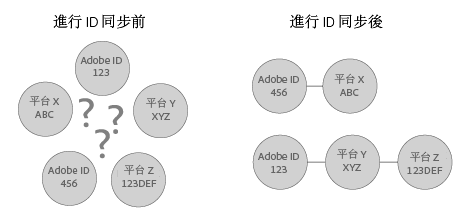

# 瞭解 ID 同步和匹配率{#understanding-id-synchronization-and-match-rates}

概述 Experience Cloud ID 服務 (包括 Adobe Media Optimizer 和 ID 服務) 中的 ID 同步程序與匹配率。

## ID 同步和匹配率 {#section-f652aae7234945e89d26dd833c5215fb}

ID 同步程序會將 ID 服務指派的 ID 匹配至我們客戶指派給網站訪客的 ID。例如，假設 ID 服務指派了 ID 1234 給一個訪客。另一個平台則透過 ID 4321 認識這個訪客。ID 服務會在同步過程間將這些 ID 對應在一起。此結果會新增資料點至客戶用來認識其網站訪客的項目。此外，如果 ID 服務無法匹配 ID，則會建立新的 ID 並使用該 ID 來進行未來的同步程序。

匹配率用來測量並驗證 ID 同步程序的有效性。匹配率高的服務代表更有效，比起匹配率低的服務能提供存取權限給更多的線上觀眾。比較匹配率是一個可用來評估不同整合廣告技術平台的量化方法。



**確保高匹配率**

若想產生高匹配率，請務必正確設定 ID 服務 (請參閱[標準實作指南](../implementation-guides/standard.md#concept-89cd0199a9634fc48644f2d61e3d2445))。正確的實作能夠確保高匹配率，因為可讓 ID 服務設定其運作所需的 Cookie，並將 ID 與已啟用的資料合作夥伴進行同步。不過，網際網路連線過慢、從行動裝置或無線網路收集資料等因素，有可能影響 ID 服務收集、同步與匹配 ID 的效果。這些用戶端變數不在 ID 服務或 [!DNL Adobe] 的控制範圍之內。

## 描述的 ID 同步程序 {#section-a541a85cbbc74f5682824b1a2ee2a657}

ID 服務會即時同步 ID。此程序在瀏覽器中運作，而非透過伺服器對伺服器的資料傳輸。下表說明 ID 同步程序的步驟。

**步驟 1: 載入頁面**

訪客造訪您的網站並載入頁面時，`Visitor.getInstance` 函數會向 ID 服務發出 [CORS](../reference/cors.md#concept-6c280446990d46d88ba9da15d2dcc758) 或 JSON-P 呼叫。ID 服務使用 Cookie 回應，其中包含訪客的 [!DNL Experience Cloud] ID (MID)。MID 是指派給每個網站訪客的唯一 ID。另請參閱 [Cookie 和 Experience Cloud ID 服務](../introduction/cookies.md)。

**步驟 2: 載入 iFrame**

當頁面本文載入時，ID 服務會載入一個 iFrame (稱為*`Destination Publishing iFrame`*。[!DNL Destination Publishing iFrame] 會在不同於上層頁面的網域中載入。這種設計有助於確保頁面效能並提高安全性，因為 iFrame:

* 相對於上層頁面為非同步載入。這表示上層頁面可與 [!DNL Destination Publishing iFrame] 分開載入。載入 iFrame 以及在 iFrame 中載入 ID 同步像素不會影響上層頁面或使用者體驗。
* 能盡快載入。如果您覺得太快了，則可在視窗載入事件後再載入 iFrame (不建議)。請參閱[idSyncAttachIframeOnWindowLoad](../library/function-vars/idsyncattachiframeonwindowload.md#reference-b86b7112e0814a4c82c4e24c158508f4) 以了解詳細資訊。
* 防止 iFrame 中的程式碼影響或是取得上層頁面的存取權。

另請參閱,[Experience Cloud ID 服務如何請求與設定 ID...](../introduction/id-request.md#concept-2caacebb1d244402816760e9b8bcef6a).

**步驟 3: 觸發 ID 同步**

ID 同步是一個可在 Destination Publishing iFrame 中觸發的 URL。如以下通用範例所示，ID 同步 URL 包含合作夥伴的 ID 同步端點以及重新導向 URL，這會重新導向回包含其 ID 的 [!DNL Adobe]。

```
http://abc.com?partner_id=abc&sync_id=123&redir=http://dpm.demdex.net/ibs:dpid=<
<varname>
  ADOBE_PARTNER_ID
</varname>>&dpuuid=<
<varname>
  PARTNER_UUID
</varname>>
```

另請參閱[傳入資料傳輸的 ID 同步](https://marketing.adobe.com/resources/help/zh_TW/aam/c_id_sync_in.html)。

**步驟 4: 儲存 ID**

同步的 ID 會儲存在[邊緣與核心資料伺服器](https://marketing.adobe.com/resources/help/zh_TW/aam/c_compedge.html)中。

## 同步服務負責管理 ID 同步作業 {#section-cd5784d7ad404a24aa28ad4816a0119a}

*`Sync Services`*一詞指的是負責 ID 同步作業的內部 [!DNL Experience Cloud] 技術。此服務預設為啟用。若要停用，請新增一個[選用變數](../library/function-vars/disableidsync.md#reference-589d6b489ac64eddb5a7ff758945e414)至 ID 服務 `Visitor.getInstance` 函數。同步服務可以匹配不同的 [!DNL Experience Cloud] ID，例如:

* 第三方 [!DNL Experience Cloud] Cookie ID 和第一方 [!DNL Experience Cloud] ID。

* 第一方 [!DNL Experience Cloud] Cookie ID 和 [!DNL Adobe Media Optimizer] (AMO) ID。

* 第三方 [!DNL Experience Cloud] Cookie ID 和第三方資料提供者與鎖定平台 ID。這包括資料提供者、需求及/或供應方平台、廣告網路、交換等服務和平台。
* 第一方 [!DNL Experience Cloud] Cookie ID 和跨裝置合作夥伴 ID。

## 與 Adobe Media Optimizer 進行 ID 同步 {#section-642c885ea65d45ffb761f78838735016}

[!DNL Adobe Media Optimizer] 是 iFrame 型 ID 同步程序的例外情況。由於 [!DNL Media Optimizer] 是值得信賴的網域，ID 同步會從上層頁面而不是在 [!DNL Destination Publishing iFrame] 進行。同步期間，ID 服務會在 [!DNL Media Optimizer] 呼叫 `cm.eversttech.net`，這是 [!DNL Media Optimizer] 在 Adobe 收購前所使用的舊版網域名稱。將資料傳送至 [!DNL Media Optimizer] 有助於改善匹配率，而且這是使用 2.0 版 (或更新版本) 的 ID 服務之客戶的專屬自動功能。另請參閱 [Media Optimizer Cookie](https://marketing.adobe.com/resources/help/zh_TW/whitepapers/cookies/cookies_media_optimizer.html)。

>[!MORE_LIKE_THIS]
>
>* [瞭解向 Demdex 網域進行的呼叫](https://marketing.adobe.com/resources/help/zh_TW/aam/demdex-calls.html)

