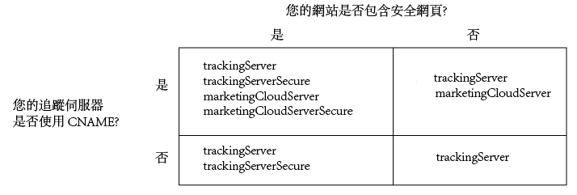

# 實施適用於 Analytics 的 Experience Cloud ID 服務 {#implement-the-experience-cloud-id-service-for-analytics}

這些指示適用於想使用 Experience Cloud ID 服務但不想使用動態標籤管理 (DTM) 的 Analytics 客戶。不過，我們強烈建議您使用 DTM 來實施 ID 服務。DTM 可簡化工作流程並自動確保程式碼的放置和順序正確無誤。

>[!IMPORTANT]
>
>* [先閱讀需求](../mcvid-reference/mcvid-requirements.md)，再開始使用。
>* 先在開發環境中設定與測試此程式碼，然後才在生產中實作。
>


請遵循下列步驟，實作Adobe Analytics的ID服務：

1. [下載ID服務程式碼](../mcvid-implementation-guides/mcvid-setup-analytics.md#section-ead9403a6b7e45b887f9ac959ef89f7f)
1. [將Visitor. getInstance函數新增至ID服務程式碼](../mcvid-implementation-guides/mcvid-setup-analytics.md#section-6053a6b7c16c466a9f9fdbf9cb9db3df)
1. [將Experience Cloud組織ID新增至Visitor. getInstance](../mcvid-implementation-guides/mcvid-setup-analytics.md#section-7b8a6e76dc124d0e9ab1ce96ab2ffb0e)
1. [將追蹤伺服器新增至Visitor. getInstance](../mcvid-implementation-guides/mcvid-setup-analytics.md#section-70ec9ebff47940d8ab520be5ec4728c5)
1. [更新AppMeasurement. js或s_ code. js檔案](../mcvid-implementation-guides/mcvid-setup-analytics.md#section-b53113aea1bd4de896e0e4e9a7edee19)
1. [新增訪客API程式碼至頁面](../mcvid-implementation-guides/mcvid-setup-analytics.md#section-d46d6aa324c842f2931d901e38d6db1d)
1. [(選擇性)設定寬限期](../mcvid-implementation-guides/mcvid-setup-analytics.md#section-7bbb2f72c26e4abeb8881e18366797a3)
1. [測試並部署ID服務程式碼](../mcvid-implementation-guides/mcvid-setup-analytics.md#section-e9c1764ac21a4ec5be1ff338c0e2e01b)

## 步驟1：下載ID服務程式碼 {#section-ead9403a6b7e45b887f9ac959ef89f7f}

需要 [!DNL ID Service]`VisitorAPI.js` 程式碼程式庫。若要下載此程式碼程式庫:

1. 前往 **[!UICONTROL 「管理員]** &gt; **[!UICONTROL 代碼管理器]**」。
1. In [!DNL Code Manager]，click each **[!UICONTROL JavaScript(new)]** or **[!UICONTROL JavaScript(舊版)]**。

   即會下載壓縮的程式碼程式庫。

1. 解壓縮程式碼檔案，並開啟 `VisitorAPI.js` 檔案。

## 步驟 2.將Visitor. getInstance函數新增至ID服務程式碼 {#section-6053a6b7c16c466a9f9fdbf9cb9db3df}

>[!IMPORTANT]
>
>* 舊版 ID 服務 API 將此函數放置在不同位置，因此需要不同語法。如果您要從 [1.4 版](../mcvid-release-notes/mcvid-notes-2015.md#section-f5c596f355b14da28f45c798df513572)之前的版本移轉，請注意此處說明的新位置和語法。
>* 全部大寫的程式碼是實際值的預留位置。請以您的組織 ID、追蹤伺服器 URL 或其他具名值來取代此文字。
>


**第 1 部分: 複製下方的 Visitor.getInstance 函數**

```js
var visitor = Visitor.getInstance("INSERT-MARKETING-CLOUD-ORGANIZATION-ID-HERE", { 
     trackingServer: "INSERT-TRACKING-SERVER-HERE", // same as s.trackingServer 
     trackingServerSecure: "INSERT-SECURE-TRACKING-SERVER-HERE", // same as s.trackingServerSecure 
 
     // To enable CNAME support, add the following configuration variables 
     // If you are not using CNAME, DO NOT include these variables 
     marketingCloudServer: "INSERT-TRACKING-SERVER-HERE", 
     marketingCloudServerSecure: "INSERT-SECURE-TRACKING-SERVER-HERE" // same as s.trackingServerSecure 
}); 
```

**第 2 部分: 將函數程式碼新增至 VisitorAPI.js 檔案**

將 `Visitor.getInstance` 函數放置在程式碼區塊之後的檔案結尾。您編輯的檔案應該看起來如下所示:

```js
/* 
========== DO NOT ALTER ANYTHING BELOW THIS LINE ========== 
Version and copyright section 
*/ 
 
// Visitor API code library section 
 
// Put Visitor.getInstance at the end of the file, after the code library

var visitor = Visitor.getInstance("INSERT-MARKETING-CLOUD-ORGANIZATION-ID-HERE", { 
     trackingServer: "INSERT-TRACKING-SERVER-HERE", // same as s.trackingServer 
     trackingServerSecure: "INSERT-SECURE-TRACKING-SERVER-HERE", // same as s.trackingServerSecure 
 
     // To enable CNAME support, add the following configuration variables 
     // If you are not using CNAME, DO NOT include these variables 
     marketingCloudServer: "INSERT-TRACKING-SERVER-HERE", 
     marketingCloudServerSecure: "INSERT-SECURE-TRACKING-SERVER-HERE" // same as s.trackingServerSecure 
}); 
```

## 步驟3：將Experience Cloud組織ID新增至Visitor. getInstance {#section-7b8a6e76dc124d0e9ab1ce96ab2ffb0e}

`Visitor.getInstance` 在函數中，以 `INSERT-MARKETING-CLOUD-ORGANIZATION ID-HERE`[!DNL Experience Cloud] 您的組織ID取代。如果您不知道組織 ID，可以在 [!DNL Experience Cloud] 管理頁面中找到。另請參閱[管理 - 核心服務](https://marketing.adobe.com/resources/help/en_US/mcloud/admin_getting_started.html)。您編輯的函數看起來可能類似於下列範例。

`var visitor = Visitor.getInstance("1234567ABC@AdobeOrg", { ...`

>[!IMPORTANT]
>
>*請勿* 變更組織ID中的字元大小寫。ID 區分大小寫，需如實使用。

## 步驟4：將追蹤伺服器新增至Visitor. getInstance {#section-70ec9ebff47940d8ab520be5ec4728c5}

追蹤伺服器用於 [!DNL Analytics] 資料收集。

**第 1 部分: 尋找您的追蹤伺服器 URL**

檢查您 `s_code.js` 或 `AppMeasurement.js` 檔案以尋找追蹤伺服器URL。您想根據下列變數指定 URL:

* `s.trackingServer`
* `s.trackingServerSecure`

**第 2 部分: 設定追蹤伺服器變數**

若要確定要使用的追蹤伺服器變數:

1. 回答以下決策矩陣中的問題。使用對應答案的變數。
1. 將追蹤伺服器預留位置取代為您的追蹤伺服器 URL。
1. 將未使用的追蹤伺服器與 [!DNL Experience Cloud] 伺服器變數從程式碼中移除。



>[!NOTE]
>
>使用時，請將 [!DNL Experience Cloud] 伺服器URL與其對應的追蹤伺服器URL配對，例如：&gt;
>* [!DNL Experience Cloud] 伺服器URL=追蹤伺服器URL
>* [!DNL Experience Cloud] 伺服器安全URL=追蹤伺服器安全URL
>


如果您不確定如何找到追蹤伺服器，請參閱 [常見問題](../mcvid-faq-intro/mcvid-faq.md) 並 [正確填入trackingServer和trackingServerSecure變數](https://helpx.adobe.com/analytics/kb/determining-data-center.html#)。

## 步驟5：更新AppMeasurement. js或s_ code. js檔案 {#section-b53113aea1bd4de896e0e4e9a7edee19}

將此函數新增至您 `AppMeasurement.js` 的檔案或 `s_code.js` 檔案：

`s.visitor = Visitor.getInstance("INSERT-MARKETING-CLOUD-ORGANIZATION ID-HERE");`

將程式碼放在包含設定( `linkInternalFilters`例如， `charSet`等 `trackDownloads`)的同一個區段中。

***(可選用，但建議使用)*建立自訂 Prop**

設定自訂prop或 `AppMeasurement.js``s_code.js` 測量涵蓋範圍。將此自訂prop新增至 `doPlugins` 您 `AppMeasurement.js` 或 `s_code.js` 檔案的函數：

```js
// prop1 is used as an example only. Choose any available prop. 
s.prop1 = (typeof(Visitor) != "undefined" ? "VisitorAPI Present" : "VisitorAPI Missing");
```

## 步驟6：新增訪客API程式碼至頁面 {#section-d46d6aa324c842f2931d901e38d6db1d}

將 `VisitorAPI.js` 檔案放置在每個頁面上的 `<head>` 標記內。將 `VisitorAPI.js` 檔案放到頁面中時:

* 將它放在 `<head>` 區段的開頭處，它會出現在其他解決方案標籤之前。
* 必須在 AppMeasurement 及其他 [!DNL Experience Cloud] 解決方案的程式碼之前執行此檔案。

測試並驗證之後，將程式碼移至生產環境。

## 步驟7：(選擇性)設定寬限期 {#section-7bbb2f72c26e4abeb8881e18366797a3}

如果有任何使用案例適用於您的情況，請要求 [客戶服務](https://helpx.adobe.com/marketing-cloud/contact-support.html) 設定暫時 [寬限期](../mcvid-reference/mcvid-analytics-reference/mcvid-grace-period.md)。寬限期可執行最多 180 天。您可以視需要更新寬限期。

**部分實施**

如果部分頁面使用 ID 服務，部分頁面未使用，且這些頁面全部都向相同的 [!DNL Analytics] 報表套裝報告，則您需要寬限期。如果您的全域報表套裝可針對不同網域提出報告，這個情況是很常見的。

當 ID 服務已部署在報告至相同報表套裝的所有網頁之後，則可停止寬限期。

**s_vi Cookie 需求**

如果您要求新訪客在移轉至 ID 服務之後擁有 s_vi Cookie，則需要寬限期。如果實施讀取 s_vi Cookie 並將其儲存在變數中，這個情況是很常見的。

當您的實施可擷取 MID，而非讀取 s_vi Cookie 之後，則可停止寬限期。

請參閱, [Cookie 和 Experience Cloud ID 服務](../mcvid-introduction/mcvid-cookies.md).

如果您將資料從點擊流資料資料源傳送至內部系統，而且該程序使用 `visid_high` 和 `visid_low` 欄位，則需要寬限期。

資料擷取程序可使用 `post_visid_high``post_visid_low` 和欄後，停止寬限期。

請參閱[點擊流資料欄位參考](https://marketing.adobe.com/resources/help/en_US/sc/clickstream/datafeeds_reference.html)。

**點擊流 (Clickstream) 資料擷取**

## 步驟8：測試並部署ID服務程式碼 {#section-e9c1764ac21a4ec5be1ff338c0e2e01b}

您可以依下列方式進行測試和部署。

**測試並驗證**

若要測試您的 ID 服務實施，請檢查:

* 托管網頁之網域中的 [AMCV Cookie](../mcvid-introduction/mcvid-cookies.md)。
* 透過 [!DNL Analytics]Adobe 偵錯工具[檢查 ](https://marketing.adobe.com/resources/help/en_US/sc/implement/debugger.html) 影像請求中的 MID 值。

請參閱「 [測試和驗證Experience Cloud ID服務](../mcvid-implementation-guides/mcvid-test-verify.md)」。

**部署程式碼**

當程式碼通過測試後，進行部署。

如果您在[步驟 7](../mcvid-implementation-guides/mcvid-setup-analytics.md#section-7bbb2f72c26e4abeb8881e18366797a3) 中已啟用寬限期:

* 請確保 [!DNL Analytics] ID (AID) 與 MID 位於影像請求中。
* 當您符合中止條件時，請記得停用寬限期。
