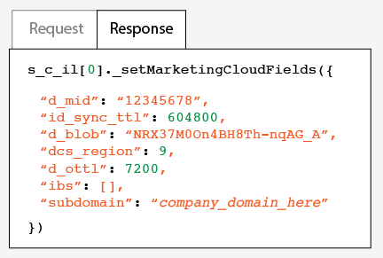
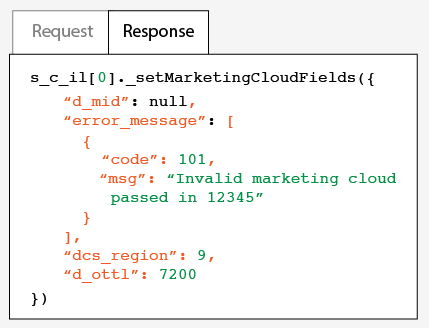

# 測試及驗證 Experience Cloud ID 服務{#test-and-verify-the-experience-cloud-id-service}

這些指示、工具和程序可協助您判斷 ID 服務是否正確運作。這些測試適用於一般的 ID 服務，以及不同的 ID 服務與 Experience Cloud 解決方案組合。

## 開始之前 {#section-b1e76ad552ed4eb793b6e521a55127d4}

開始測試及驗證 ID 服務前的重要須知。

**瀏覽器環境**

在一般瀏覽器工作階段中進行測試時，在每次測試前請先清除瀏覽器快取。

或者，您也可以在匿名或無痕式瀏覽器工作階段中測試 ID 服務。在匿名工作階段中，每次測試前無須清除瀏覽器 Cookie 或快取。

**工具**

[Adobe Debugger](https://marketing.adobe.com/resources/help/zh_TW/sc/implement/debugger.html) 及 [Charles HTTP Proxy](https://www.charlesproxy.com/) 可協助您判斷 ID 服務是否已正確設定為搭配 Analytics 使用。本節中的資訊是以 Adobe 偵錯工具和 Charles 傳回的結果為主。不過，您當然可以使用最適合您的任何工具或偵錯工具。

## 使用 Adobe 偵錯工具進行測試{#section-861365abc24b498e925b3837ea81d469}

如果您在 [!DNL Experience Cloud ID] 偵錯工具回應中看到 [!DNL Adobe] (MID)，代表您的服務整合已正確設定。請參閱 [Cookie 與 Experience Cloud ID](../mcvid-introduction/mcvid-cookies.md)，以瞭解有關 MID 的資訊。

若要使用 [!DNL Adobe] [Debugger](https://marketing.adobe.com/resources/help/zh_TW/sc/implement/debugger.html) 驗證 ID 服務的狀態:

1. 清除瀏覽器 Cookie 或開啟匿名瀏覽工作階段。
1. 載入包含 ID 服務程式碼的測試頁面。
1. 開啟 [!DNL Adobe] 偵錯工具。
1. 查看 MID 的結果。

## 瞭解 Adobe Debugger 的結果 {#section-bd2caa6643d54d41a476d747b41e7e25}

MID 儲存在使用下列語法的機碼-值組中: `MID= *`Experience Cloud ID`*`。偵錯工具會顯示此項資訊，如下所示。

**成功**

如果您看到類似以下的回應，代表 ID 服務已正確實施:

```
mid=20265673158980419722735089753036633573
```

如果您是 [!DNL Analytics] 客戶，則除了 MID，還可能看到 [!DNL Analytics] ID (AID)。這可能發生在下列情形:

* 某些早期/長期網站訪客。
* 您已啟用寬限期。

**失敗**

若 Debugger 發生以下情況，請聯絡[客戶服務](https://helpx.adobe.com/tw/marketing-cloud/contact-support.html):

* 無法傳回 MID。
* 傳回錯誤訊息，指出您的 ID 尚未佈建。

## 使用 Charles HTTP Proxy 進行測試 {#section-d9e91f24984146b2b527fe059d7c9355}

若要使用 Charles 驗證 ID 服務的狀態:

1. 清除瀏覽器 Cookie 或開啟匿名瀏覽工作階段。
1. 啟動 Charles。
1. 載入包含 ID 服務程式碼的測試頁面。
1. 查看要求和回應呼叫，以及下方所述的資料。

## 瞭解 Charles 的結果 {#section-c10c3dc0bb9945cbaffcf6fec7082fab}

請參閱本節以了解當您使用 Charles 監控 HTTP 呼叫時，應至何處查看哪些項目。

**Charles 中的成功 ID 服務要求**

當 `Visitor.getInstance` 函數對 `dpm.demdex.net` 進行 JavaScript 呼叫時，表示您的 ID 服務程式碼正常運作。成功的要求包含[組織 ID](../mcvid-reference/mcvid-requirements.md#section-a02f537129a64ffbb690d5738d360c26)。組織 ID是以使用下列語法的機碼-值組來傳遞: `d_orgid= *`organization ID`*`。查看 `dpm.demdex.net` 標籤下方的 [!DNL Structure] 和 JavaScript 呼叫。查看 [!DNL Request] 標籤下方的組織 ID。


**Charles 中的成功 ID 服務回應**

當來自[資料收集伺服器](https://marketing.adobe.com/resources/help/zh_TW/aam/c_compcollect.html) (DCS) 的回應傳回 MID，表示您的帳號已正確佈建 ID 服務。MID 是以使用下列語法的機碼-值組傳回: `d_mid: *`visitor Experience Cloud ID`*`。查看 [!DNL Response] 標籤中的 MID，如下所示。



**Charles 中的失敗 ID 服務回應**

如果 DCS 回應中缺少 MID，表示您的帳戶未正確佈建。失敗的回應會在 [!DNL Response] 標籤中傳回錯誤碼和訊息，如下所示。如果您在 DCS 回應中看到這個錯誤訊息，請聯絡客戶服務。



如需有關錯誤碼的詳細資訊，請參閱 [DCS 錯誤碼、訊息與範例](https://marketing.adobe.com/resources/help/zh_TW/aam/dcs_error_codes.html)。
