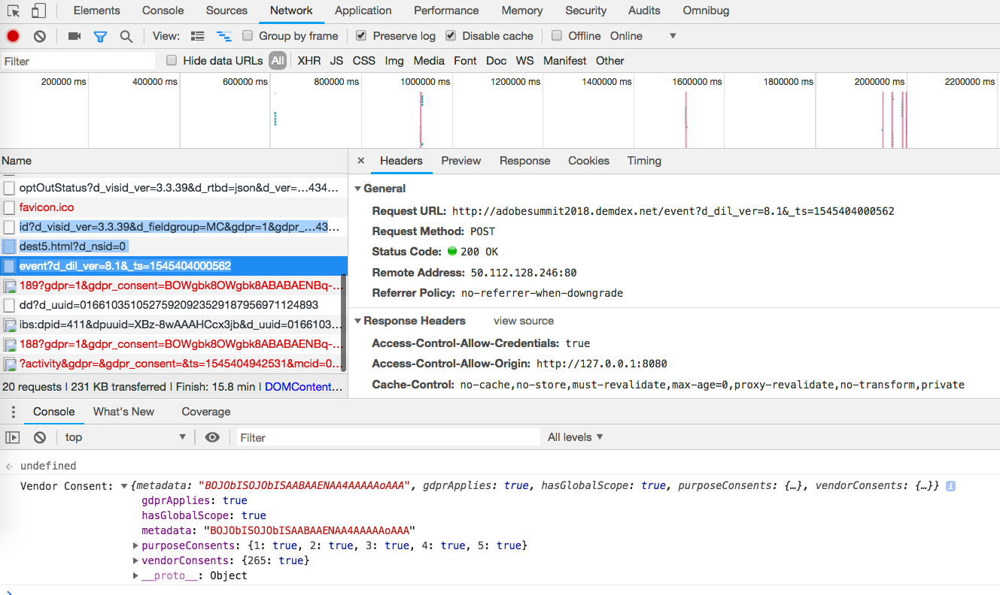

# 驗證選擇加入服務{#validating-opt-in-service}

在您的網站啓用選擇加入後，請使用驗證方法測試服務是否如預期使用瀏覽器中的開發人員工具運作。

## 使用案例1：啓用選擇加入 {#section-c8fe1ee3711b420c8186c7057abbecb3}

```
Visitor.getInstance({{YOUR_ORG_ID}}, { 
    doesOptInApply: true 
});
```


載入頁面前，請清除快取和 Cookie。

在 Chrome 中，以滑鼠右鍵按一下網頁，然後選取「檢查」。如上方截圖所示，請選取*「網路」*標籤以檢視瀏覽器提出的要求。

在上例中，我們在網頁中安裝下列 Adobe JS 標籤: ECID、AAM、Analytics 和 Target。

**如何證明選擇加入的工作如預期：**

您不應該看到任何傳送到 Adobe 伺服器的要求:

* demdex.net/id
* demdex.net/event
* omtrdc.net/b/ss
* omtrdc.net/m2
* everesttech.net

>[!NOTE]
>
>您可能會看見呼叫， `http://dpm.demdex.net/optOutStatus`這是一個「唯讀」端點，用來擷取訪客的退出狀態。此端點不會導致任何第三方 Cookie 成功建立，且不會收集頁面中的任何資訊。

您不應該會看到 Adobe 標籤建立的任何 Cookie: AMCV_{{YOUR_ORG_ID}}、mbox、demdex、s_cc、s_sq、everest_g_v2、everest_session_v2

在 Chrome 中，前往*「應用程式」*標籤，展開*「儲存」*下的*「Cookies」*區段，然後選取您網站的網域名稱:


## 使用案例 2: 啟用選擇加入與儲存 {#section-bd28326f52474fa09a2addca23ccdc0f}

```
Visitor.getInstance({{YOUR_ORG_ID}}, { 
    doesOptInApply: true, 
    isOptInStorageEnabled: true 
});
```

使用案例 2 中唯一的差異在於，您會看到*一個新 Cookie*，此 Cookie 會包含訪客提供的選擇加入權限: **adobeujs-optin**

## 使用案例3: 啟用選擇加入及預先核准 Adobe Analytics {#section-257fe582b425496cbf986d0ec12d3692}

```
var preApproveAnalytics = {}; 
preApproveAnalytics[adobe.OptInCategories.ANALYTICS] = true;

Visitor.getInstance({{YOUR_ORG_ID}}, { 
    doesOptInApply: true, 
    preOptInApprovals: preApproveAnalytics 
});
```

由於 Adobe Analytics 已預先通過選擇加入核准，您會在「網路」標籤中看到傳送至您追蹤伺服器的要求:


且您會在「應用程式」標籤中看到 Analytics Cookie:


## 使用案例 4: 啟用選擇加入與 IAB {#section-64331998954d4892960dcecd744a6d88}

```
Visitor.getInstance({{YOUR_ORG_ID}}, { 
    doesOptInApply: true, 
    isIabContext: true 
});
```

**如何在頁面上檢視您目前的 IAB 同意:**

開啟開發人員工具，然後選取*「主控台」*標籤。貼上下列程式碼片段，然後按下 Enter 鍵:

```
<codeblock>
  __cmp("getVendorConsents", null, function (vendorConsents) { 
     console.log("Vendor Consent:", vendorConsents); }) 
</codeblock>  
  
```

以下是目的 1、2 和 5 通過核准且 Audience Manager 廠商 ID 通過核准時的範例輸出結果:

* demdex.net/id: 若有此呼叫，就表示 ECID 已從 demdex.net 要求 ID。
* demdex.net/event: 若有此呼叫，就表示 DIL 資料收集呼叫順利運作。
* demdex.net/dest5.html: 若有此呼叫，就表示已觸發 ID 同步。



如果下列任一情況無效，您便不會看到任何傳送到 Adobe 伺服器的要求，且不會有 Adobe Cookie:

* 目的 1、2「或」5 未通過核准。
* Audience Manager 廠商 ID 未通過核准。