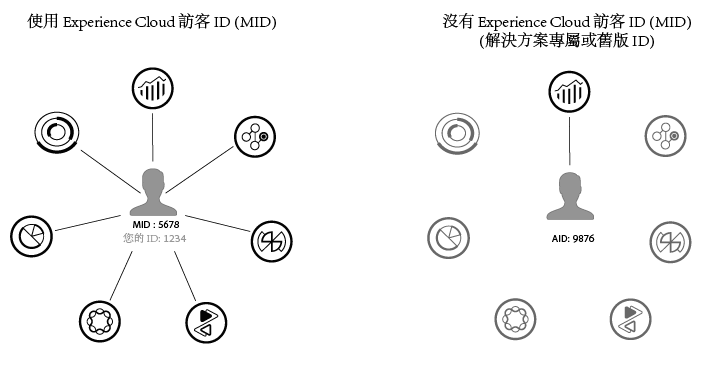

# 概述

Experience Cloud ID 服務可為 Experience Cloud 核心服務、解決方案以及 People 核心服務的客戶屬性和觀眾啟用共同識別架構。其運用方式為指派一個唯一的永久性 ID 給網站訪客。當您的組織實施 ID 服務時，此 ID 可讓您在不同的 Experience Cloud 解決方案中識別相同的網站訪客及其資料。

此外，ID 服務也能取代不同的解決方案專屬 ID (例如 Analytics AID)。而透過[客戶 ID 和驗證狀態](/help/mcvid-reference/mcvid-authenticated-state.md)功能，ID 服務可讓您將您的客戶 ID 傳遞至 Experience Cloud。但是請切記，ID 服務只能搭配您已訂閱的解決方案使用。如果您未註冊其他產品，便無法存取。

展望未來，ID 服務將成為許多目前與未來 Experience Cloud 特色、增強功能與服務的必要元件。目前 ID 服務支援 [Analytics](https://www.adobe.com/tw/analytics/web-analytics.html)、[Audience Manager](https://www.adobe.com/tw/analytics/audience-manager.html) 及 [Target](https://www.adobe.com/tw/marketing/target.html)。此外，如果您想參與 Adobe Experience Cloud Device Co-op，也需要用到 ID 服務。如果您尚未實施 ID 服務，現在就是開始考慮移轉策略的最佳時機。如需 ID 服務之重要性和角色的詳細資訊，請參閱[為何您應認真考慮 Experience Cloud ID 服務](http://blogs.adobe.com/digitalmarketing/analytics/why-new-adobe-marketing-cloud-id-service-should-be-on-your-radar/)。

## 功能摘要

總而言之，ID 服務可以:

* 建立通用機碼或 ID 以用於連結設定檔和身分識別。
* 在多個解決方案中辨識唯一裝置。
* 在客戶網域中設定第一方 Cookie 以確保可在相同網域進行追蹤。請參閱Experience Cloud.
* 從 Experience Cloud 客戶和合作夥伴接收別名和 ID 對應。
* 在 Experience Cloud 中管理 ID 同步。
* 在各廣告技術生態系統中，支援不同第三方的 ID 同步。

## ID 服務需求

您的解決方案和其他 Adobe 程式碼程式庫必須符合[特定需求](/help/mcvid-reference/mcvid-requirements.md)，您才能使用 ID 服務。

* [Cookie 與 Experience Cloud ID 服務](mcvid-cookies.md): ID 服務使用您的組織 ID、Experience Cloud AMCV Cookie 及 Demdex Cookie，為您的網站訪客建立並儲存不重複的永久識別碼。這些 Cookie 可以讓 ID 服務追蹤您不同網域上的訪客，並且讓您在不同的 Experience Cloud 解決方案間共用資料。
* [Experience Cloud ID 服務服務如何要求與設定 ID](mcvid-id-request.md): 概略說明 ID要求與回應程序。這些範例涵蓋在個別網站、跨不同網站，以及針對由不同 Experience Cloud 客戶 (具有自己的組織 ID) 管理的網站，進行 ID 指派。
* [瞭解 ID 同步和匹配率](mcvid-match-rates.md): 概略說明 Experience Cloud ID 服務 (包括 Adobe Media Optimizer 和 ID 服務) 中的 ID 同步程序與匹配率。